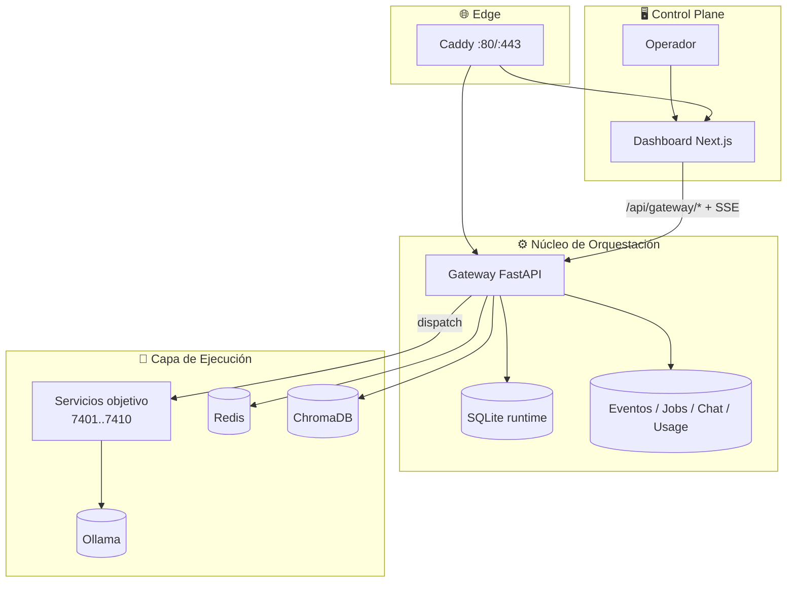
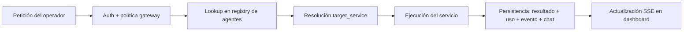

<h1 align="center">⚗️ Alchemical Agent Ecosystem</h1>

<p align="center">
  
</p>

<p align="center"><em>Cockpit multiagente local-first para orquestación real, control en tiempo real y operación segura.</em></p>

<p align="center">
  
</p>

<p align="center">
  <a href="./LICENSE"></a>
  <a href="https://github.com/smouj/alchemical-agent-ecosystem/commits/main"></a>
  <a href="https://github.com/smouj/alchemical-agent-ecosystem/actions/workflows/ci.yml"></a>
  <a href="https://github.com/smouj/alchemical-agent-ecosystem/actions/workflows/release.yml"></a>
  <a href="https://github.com/smouj/alchemical-agent-ecosystem/actions/workflows/sync-project-status.yml"></a>
  
  
  
  
  
</p>

<p align="center">
  <a href="./README.md"></a>
  <a href="./README.es.md"></a>
</p>

---

## 🚀 Instalación primero (recomendado)

```bash
cd /mnt/d/alchemical-agent-ecosystem
./install.sh --wizard
./scripts/alchemical up-fast
curl -fsS http://localhost/gateway/health
```

Endpoints runtime:
- `http://localhost` → runtime vía Docker + Caddy
- `http://localhost/gateway/health` → health del gateway
- `http://localhost:3000` → dashboard en modo dev (`cd apps/alchemical-dashboard && npm run dev`)

---

## ✨ Para qué sirve este proyecto

Úsalo cuando necesites un **cockpit operativo real** para agentes que trabajan dentro de tu sistema:

- 🧠 Orquestar agentes lógicos sobre servicios reales
- 💬 Chatear con agentes y lanzar roundtables multiagente
- 🧩 Vincular skills/tools a agentes de forma visual (Agent Node Studio)
- 📡 Conectar canales (Telegram/Discord ahora, extensible a futuras redes)
- 🗂️ Observar jobs/eventos/usage/logs en tiempo real
- 🔐 Operar con guardrails (auth, RBAC, API keys, límites)

Sin comportamiento mock en los flujos core del runtime.

---

## 🏗️ Arquitectura del sistema (realidad actual)



### 🔁 Funcionamiento del agente de proyecto



---

## 🧠 Modelo de agentes (lo que muestra la UI)

El dashboard carga **agentes lógicos reales desde gateway** (fuente real), no skills estáticas mostradas como agentes.

Cada agente incluye:
- `name`
- `role`
- `model`
- `target_service`
- `skills[]`
- `tools[]`
- estado runtime/latencia a partir de contenedores + health checks

---

## 🧰 Capacidades implementadas

| Dominio | Implementado ahora |
|---|---|
| Control de agentes | Start/stop/restart, ping dispatch, estado runtime |
| Personalización de agentes | Agent Node Studio (nodos + etiquetas skills/tools) |
| Chat | Hilo compartido, ask directo, roundtable, metadata thinking/repo/auto-edit |
| Conectores | Cola saliente + normalización webhook entrante (Telegram/Discord) |
| Realtime | SSE chat/eventos/usage/logs con streams endurecidos |
| Seguridad | Token auth, RBAC, API keys, rate/payload limits, secret scan |
| Higiene operativa | project-tidy + ritual-sync + snapshots automáticos |

---

## 🔌 Conectores: estado y futuro

- ✅ Integración base Telegram (pipeline inbound/outbound)
- ✅ Integración base Discord (pipeline inbound/outbound)
- 🧭 Arquitectura preparada para futuras redes sociales con adapters por canal

---

## 📊 Comparativa rápida

| Criterio | Este proyecto | Demos típicas chat-only |
|---|---|---|
| Operación local-first | ✅ Diseño core | ⚠️ acoplado a cloud |
| Frontera de política | ✅ Gateway dedicado | ⚠️ UI mezclada con runtime |
| Observabilidad real | ✅ jobs/eventos/usage/logs | ⚠️ limitada |
| Multiagente | ✅ ask + roundtable + dispatch | ⚠️ normalmente hilo único |
| Higiene GitHub project | ✅ ritual integrado | ❌ manual |

---

## 📁 Estructura del repositorio

```text
.github/                    workflows CI/CD y project
apps/alchemical-dashboard/  dashboard Next.js (control plane)
gateway/                    gateway FastAPI (auth/routing/persistencia)
services/                   servicios de ejecución (7401..7410)
infra/caddy/                reverse proxy
infra/scripts/              implementación del instalador
ops/                        scripts de operación segura/higiene
docs/                       documentación técnica y operativa
scripts/                    CLI helpers
assets/                     branding y recursos visuales
```

---

## 📚 Mapa de documentación

- [`docs/README.md`](./docs/README.md) — índice docs
- [`docs/INSTALLATION.md`](./docs/INSTALLATION.md) — instalación y arranque
- [`docs/CLI_REFERENCE.md`](./docs/CLI_REFERENCE.md) — catálogo completo de comandos
- [`docs/ARCHITECTURE.md`](./docs/ARCHITECTURE.md) — arquitectura extendida
- [`docs/API_REFERENCE.md`](./docs/API_REFERENCE.md) — referencia de endpoints
- [`docs/OPERATIONS_RUNBOOK.md`](./docs/OPERATIONS_RUNBOOK.md) — operación day-2
- [`docs/PROJECT_STATUS.md`](./docs/PROJECT_STATUS.md) — snapshot autosincronizado

---

## 🔄 Actualización segura para producción

```bash
cd /mnt/d/alchemical-agent-ecosystem
git pull --rebase origin main
./scripts/alchemical update-safe
```

---

## 📄 Licencia

MIT
