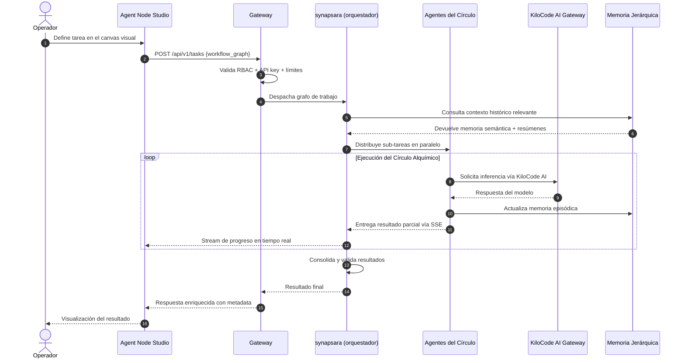
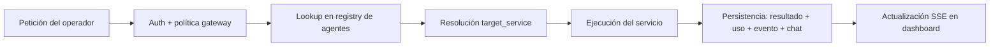

<div align="center">

<!-- Sigilo del ecosistema -->


# ⚗️ Alchemical Agent Ecosystem v2.0

### *Magnum Opus*

[](https://github.com/smouj/alchemical-agent-ecosystem)
[](LICENSE)
[](https://github.com/smouj/alchemical-agent-ecosystem/commits/main)
[](https://github.com/smouj/alchemical-agent-ecosystem/actions/workflows/ci.yml)
[](https://nextjs.org)
[](https://fastapi.tiangolo.com)
[](https://kilo.ai)
[](https://github.com/smouj/alchemical-agent-ecosystem)
[](https://github.com/smouj/alchemical-agent-ecosystem)
[](https://github.com/smouj/alchemical-agent-ecosystem)
[](https://github.com/smouj/alchemical-agent-ecosystem)

---

<a href="./README.md"></a>
&nbsp;
<strong></strong>

---

[](https://github.com/smouj/alchemical-agent-ecosystem)

</div>

---

## ✦ La Gran Transmutación

Existe un sueño antiguo en la alquimia: convertir la materia bruta en oro puro mediante el conocimiento, la disciplina y el fuego correcto. El **Alchemical Agent Ecosystem** es ese sueño convertido en software.

No es un envoltorio de ChatGPT. No es una interfaz para la API de otro. Es una **plataforma multi-agente de filosofía local-first**, forjada desde el primer principio: que la inteligencia artificial verdaderamente poderosa no debería depender de infraestructura ajena para tus datos, ni de costos impredecibles, ni de la benevolencia de ninguna corporación.

Aquí, en tu propia infraestructura, conviven:

- Un **dashboard visual** (`Agent Node Studio`) donde los agentes se componen como circuitos alquímicos — arrastrando nodos, trazando flujos, observando en tiempo real cómo el pensamiento se propaga de capa en capa.
- Un **gateway inteligente** que enruta, autentica, recuerda y orquesta sin descanso, actuando como límite de política entre el mundo exterior y el núcleo de ejecución.
- **Diez servicios de ejecución** nombrados como fuerzas elementales — `velktharion`, `synapsara`, `kryonexus`, `noctumbra-mail`, `temporaeth`, `vaeloryn-conclave`, `ignivox`, `auralith`, `resonvyr`, `fluxenrath` — cada uno con su dominio, sus capacidades y su lugar en la Gran Obra.
- **Memoria jerárquica** que no olvida: Redis para el instante, ChromaDB para la semántica, agentes resumen para la continuidad a largo plazo.
- **Modelos invocados a través de KiloCode AI Gateway** — Claude, Gemini, MiniMax, y más — sin almacenar ni un solo dato tuyo en servidores externos.
- **Círculos Alquímicos**: equipos de agentes que se auto-forman, colaboran en paralelo y producen resultados que ningún agente solitario podría alcanzar.

> *"Solve et Coagula"* — disuelve lo complejo en partes comprensibles, y después coaguélalo en una obra mayor. Eso es exactamente lo que hace este ecosistema con tus tareas de automatización.

El **Magnum Opus** no es la versión final. Es la primera versión que merece ese nombre.

---

## 🖼️ Capturas de Pantalla — Diseño 2026

> **✨ Nuevo Sistema de Diseño Alquímico 2026**: Negro profundo (#050505), acentos dorados líquidos (#d4af37) y cobre, paneles glassmorphism con bordes holográficos, y animaciones butter-smooth con framer-motion.

<p align="center">
  <strong>💬 Chat del Caldero — Interacción Multi-Agente</strong><br/>
  <em>Streaming SSE en tiempo real con efectos de brillo etéreo</em><br/>
  
</p>

<p align="center">
  <strong>🧩 Agent Node Studio — Constructor Visual de Flujos</strong><br/>
  <em>Canvas React Flow con nodos alquímicos personalizados y conexiones animadas</em><br/>
  
</p>

<p align="center">
  <strong>🤖 Runtime de Agentes — Estado de Agentes en Vivo</strong><br/>
  <em>Métricas en tiempo real con animaciones de pulso e indicadores de estado</em><br/>
  
</p>

<p align="center">
  <strong>📜 Logs & Telemetría — Streaming de Logs en Tiempo Real</strong><br/>
  <em>Monitor de logs con SSE y resaltado de sintaxis</em><br/>
  
</p>

<p align="center">
  <strong>🛠️ Administración — Operaciones del Sistema</strong><br/>
  <em>Panel de configuración con navegación jerárquica</em><br/>
  
</p>

### 🎨 Características del Sistema de Diseño

- **Paneles Glassmorphism**: Backdrop-blur con bordes etéreos
- **Gradientes Dorados Líquidos**: Gradientes CSS @property animados
- **Efectos Holográficos**: Bordes giratorios animados y pulsos de brillo
- **Framer Motion 12**: Transiciones de página, micro-interacciones, animaciones escalonadas
- **Tailwind CSS v4**: Motor Oxide con tokens de color alquímicos personalizados
- **Integración React Flow**: Tipos de nodos personalizados con mini-mapa y controles
- **PWA Ready**: Manifest.json con colores de tema e iconos

---

## 🚀 Inicio Rápido (El Ritual de 5 Minutos)

### Prerrequisitos

Antes de invocar la Gran Obra, asegúrate de tener los elementos en orden:

| Elemento | Versión mínima | Propósito |
|---|---|---|
| `Docker` + `Docker Compose` | 24+ | El crisol que contiene todo |
| `Node.js` | 20 LTS | Alimenta el dashboard |
| `Python` | 3.11+ | Motor del gateway y los servicios |
| `KILO_API_KEY` | — | Clave de [kilo.ai](https://kilo.ai) (tier gratuito disponible) |
| RAM libre | 8 GB mínimo | Los agentes necesitan espacio para pensar |

### Paso 1 — Clona el repositorio

```bash
git clone https://github.com/smouj/alchemical-agent-ecosystem.git
cd alchemical-agent-ecosystem
```

### Paso 2 — Ejecuta el asistente de instalación

```bash
./install.sh --wizard
```

El asistente te guiará por la configuración inicial y generará tu archivo `.env` con valores sensatos para uso local.

Si prefieres hacerlo manualmente, copia el ejemplo y edita lo que necesites:

```bash
cp .env.example .env
nano .env  # o tu editor favorito
```

Las variables esenciales:

```dotenv
# ── Identidad del ecosistema ──────────────────────────────────
ECOSYSTEM_SECRET_KEY="cambia-esto-por-algo-fuerte"

# ── Base de datos ─────────────────────────────────────────────
POSTGRES_DB=alchemical
POSTGRES_USER=alchemist
POSTGRES_PASSWORD=gran_obra_secreta

# ── Redis ─────────────────────────────────────────────────────
REDIS_URL=redis://redis:6379/0

# ── KiloCode AI Gateway ───────────────────────────────────────
KILO_BASE_URL=https://api.kilo.ai/api/gateway
KILO_API_KEY=tu-clave-de-kilo-ai
KILO_DEFAULT_MODEL=anthropic/claude-sonnet-4.5

# ── Conectores (opcionales — déjalos vacíos si no los usas) ───
TELEGRAM_BOT_TOKEN=
DISCORD_BOT_TOKEN=
```

### Paso 3 — Levanta el crisol

```bash
./scripts/alchemical up-fast
```

O directamente con Docker Compose:

```bash
docker compose up -d
```

Este comando inicia simultáneamente: PostgreSQL con `pgvector`, Redis, ChromaDB, el gateway FastAPI, los diez servicios de ejecución y el dashboard Next.js.

### Paso 4 — Verifica que todo respira

```bash
curl -fsS http://localhost/gateway/health
```

Una respuesta `200 OK` con el estado de cada componente confirma que la transmutación fue exitosa.

### Paso 5 — Abre el portal

| Interfaz | URL |
|---|---|
| Dashboard (modo runtime) | `http://localhost` |
| Dashboard (modo dev) | `http://localhost:3000` |
| Gateway API Docs | `http://localhost/gateway/docs` |
| ChromaDB | `http://localhost:8001` |

El `Agent Node Studio` te recibirá. Crea tu primer agente. Observa cómo piensa.

> **Modo desarrollo del dashboard:**
> ```bash
> cd apps/alchemical-dashboard
> npm run dev
> # → http://localhost:3000
> ```

---

## 🌌 Arquitectura – Los Siete Círculos

La arquitectura refleja la cosmología alquímica: capas concéntricas donde cada círculo purifica y eleva lo que recibe del anterior. El gateway es la frontera sagrada — nada entra ni sale sin pasar por él.

### Vista general del sistema

```mermaid
flowchart TB
  subgraph Edge["🌐 Capa de Borde"]
    CADDY["Caddy :80 / :443\nReverse Proxy"]
  end

  subgraph UX["🖥️ Control Plane"]
    OP["Operador"]
    DASH["Dashboard Next.js 15\nAgent Node Studio\n:3000"]
  end

  subgraph Core["⚙️ Núcleo de Orquestación"]
    GW["Gateway FastAPI\nAuth · Routing · Policy\n:8000"]
    DB[("PostgreSQL\n+ pgvector")]
    EV[("Eventos / Jobs\nChat / Usage")]
    AUTH["RBAC + API Keys"]
    SSE["SSE Observabilidad\nTiempo Real"]
  end

  subgraph Diez["🧪 Los Diez Círculos — Servicios de Ejecución"]
    S1["⚔️ velktharion :7401\nOrquestador y director"]
    S2["🧠 synapsara :7402\nMeta-razonamiento y coordinación"]
    S3["❄️ kryonexus :7403\nDatos y análisis"]
    S4["✉️ noctumbra-mail :7404\nComunicaciones y notificaciones"]
    S5["🌊 temporaeth :7405\nRazonamiento temporal"]
    S6["🏛️ vaeloryn-conclave :7406\nConsejo y deliberación"]
    S7["🔥 ignivox :7407\nConstructor e ingeniero"]
    S8["🎵 auralith :7408\nAudio y habla"]
    S9["🔊 resonvyr :7409\nLenguaje y retórica"]
    S10["⚡ fluxenrath :7410\nWeb y recuperación"]
  end

  subgraph Modelos["🤖 Capa de Modelos"]
    KILO["KiloCode AI Gateway\nClaude · Gemini · MiniMax · y más\n(api.kilo.ai)"]
  end

  subgraph Persistencia["💾 Capa de Persistencia"]
    RED[("Redis\nCache · Sesiones")]
    CHR[("ChromaDB\nVector Store")]
  end

  OP --> DASH
  CADDY --> DASH
  CADDY --> GW
  DASH -->|"REST / WebSocket / SSE"| GW
  GW --> AUTH
  GW --> SSE
  GW --> DB
  GW --> EV
  GW --> RED
  GW --> CHR
  GW -->|"dispatch con política"| S1 & S2 & S3 & S4 & S5 & S6 & S7 & S8 & S9 & S10
  S1 & S2 & S3 & S4 & S5 & S6 & S7 & S8 & S9 & S10 --> KILO
  S1 & S2 & S3 & S4 & S5 & S6 & S7 & S8 & S9 & S10 --> RED
  S1 & S2 & S3 & S4 & S5 & S6 & S7 & S8 & S9 & S10 --> CHR
```



### Flujo de una tarea orquestada



### Funcionamiento del agente de proyecto



### Topología de puertos

| Puerto | Servicio | Capa |
|---|---|---|
| `:80` / `:443` | Caddy (reverse proxy) | Borde |
| `:3000` | Dashboard Next.js | Control Plane |
| `:8000` | Gateway FastAPI | Núcleo |
| `:8001` | ChromaDB UI | Persistencia |
| `:7401` | velktharion | Ejecución |
| `:7402` | synapsara | Ejecución |
| `:7403` | kryonexus | Ejecución |
| `:7404` | noctumbra-mail | Ejecución |
| `:7405` | temporaeth | Ejecución |
| `:7406` | vaeloryn-conclave | Ejecución |
| `:7407` | ignivox | Ejecución |
| `:7408` | auralith | Ejecución |
| `:7409` | resonvyr | Ejecución |
| `:7410` | fluxenrath | Ejecución |

---

## ✨ Matriz de Capacidades

<div align="center">

| Capacidad | Descripción | Estado |
|---|---|:---:|
| **Agent Node Studio** | Constructor visual de flujos con nodos arrastrables y etiquetas de skills/tools | ✅ |
| **Orquestación LangGraph** | Grafos de agentes con estado persistente entre ejecuciones | ✅ |
| **Círculos Alquímicos** | Equipos de agentes auto-formados con roles dinámicos | ✅ |
| **Chat directo** | Hilo compartido, ask directo, metadatos thinking/repo/auto-edit | ✅ |
| **Roundtable multi-agente** | Varios agentes deliberan sobre una misma tarea | ✅ |
| **Control de agentes** | Start/stop/restart, ping dispatch, estado runtime en tiempo real | ✅ |
| **Memoria jerárquica** | Redis (instante) + ChromaDB (semántica) + agentes resumen | ✅ |
| **LLMs vía KiloCode AI** | Claude, Gemini, MiniMax, y más modelos compatibles (tier gratuito disponible) | ✅ |
| **Visión multi-modal** | Análisis de imágenes vía KiloCode (claude-3-haiku vision, gemini-flash) | ✅ |
| **Transcripción de audio** | Modelos de audio vía KiloCode (whisper y equivalentes disponibles) | ✅ |
| **RBAC + API Keys** | Control de acceso por roles y claves programáticas | ✅ |
| **SSE observabilidad** | Stream en tiempo real de chat, eventos, usage y logs | ✅ |
| **OpenTelemetry** | Trazas distribuidas, métricas y logs unificados | ✅ |
| **Conector Telegram** | Pipeline inbound/outbound, agentes accesibles desde Telegram | ✅ |
| **Conector Discord** | Pipeline inbound/outbound, integración nativa con Discord | ✅ |
| **pgvector** | Búsqueda semántica sobre PostgreSQL sin servicios externos | ✅ |
| **Sistema de plugins** | Extiende cualquier servicio con capacidades propias | ✅ |
| **Higiene GitHub project** | Ritual integrado de sincronización y snapshots automáticos | ✅ |
| **Datos 100% locales** | PostgreSQL, Redis, ChromaDB — todos en tu infraestructura | ✅ |
| **Tier gratuito de IA** | Modelos gratuitos disponibles vía KiloCode (minimax/minimax-m2.5:free, etc.) | ✅ |

</div>

---

## 🧠 El Modelo de Agentes

El dashboard carga **agentes lógicos reales desde el gateway** — no skills estáticas ni mocks. Cada agente es una entidad con ciclo de vida completo y presencia runtime.

```
┌─────────────────────────────────────────────────────────────┐
│                    CICLO VITAL DEL AGENTE                   │
│                                                             │
│   [Invocación]                                              │
│        │                                                    │
│        ▼                                                    │
│   [Percepción] ←── texto · imagen · audio · datos           │
│        │                                                    │
│        ▼                                                    │
│   [Recuperación de Memoria] ←── Redis + ChromaDB + resúmen  │
│        │                                                    │
│        ▼                                                    │
│   [Razonamiento] ←── KiloCode AI Gateway                    │
│        │                                                    │
│        ▼                                                    │
│   [Planificación de Acciones]                               │
│        │                                                    │
│        ├──► Delegar a sub-agente                            │
│        ├──► Invocar herramienta / plugin                    │
│        ├──► Escribir en memoria                             │
│        └──► Emitir resultado vía SSE                        │
│                                                             │
│   [Actualización de Estado] ──► Persistido en PostgreSQL    │
└─────────────────────────────────────────────────────────────┘
```

### Anatomía de un agente

Cada agente en el registry expone:

| Campo | Descripción |
|---|---|
| `name` | Nombre único dentro del ecosistema |
| `role` | Arquetipo funcional (orquestador, ejecutor, sensor, etc.) |
| `model` | Modelo KiloCode AI asignado (puede diferir por agente) |
| `target_service` | Servicio de ejecución que lo aloja (`synapsara`, `fluxenrath`…) |
| `skills[]` | Lista de habilidades declaradas |
| `tools[]` | Herramientas y plugins disponibles |
| `runtime_state` | Estado actual: idle / running / error |
| `latency_ms` | Latencia media de las últimas N invocaciones |

### Definición de un agente (YAML)

```yaml
# agents/analista-mercado.yaml
name: "Analista de Mercado"
version: "1.0"
role: executor
target_service: fluxenrath

model:
  provider: kilo
  name: anthropic/claude-sonnet-4.5
  temperature: 0.3
  context_window: 8192

memory:
  short_term: redis          # Conversación activa
  long_term: chromadb        # Conocimiento semántico
  episodic: postgresql       # Historial de ejecuciones

tools:
  - web_search
  - file_reader
  - data_analyzer

skills:
  - análisis financiero
  - síntesis de informes
  - detección de tendencias

system_prompt: |
  Eres un analista financiero especializado en mercados emergentes.
  Siempre citas tus fuentes. Expresas la incertidumbre cuando existe.
  Hablas en español formal a menos que se te indique lo contrario.

circle_role: executor
max_concurrent_tasks: 3
```

---

## 🔮 Círculos Alquímicos

Los **Círculos Alquímicos** son la innovación central del ecosistema. Mientras que los sistemas tradicionales asignan tareas a agentes individuales en secuencia, los Círculos permiten que **grupos de agentes se auto-organicen** en torno a un objetivo complejo, trabajando en paralelo con roles dinámicos.

El nombre evoca los círculos de la alquimia medieval — estructuras donde cada posición tiene un papel preciso y el conjunto es inmensamente más poderoso que la suma de sus partes.

### Anatomía de un Círculo

```
        ╔════════════════════════════════════╗
        ║     CÍRCULO ALQUÍMICO ACTIVO       ║
        ║                                   ║
        ║  ┌─────────────────────────────┐  ║
        ║  │    Maestro Orquestador      │  ║  ← synapsara define el plan
        ║  │  (synapsara + Claude)       │  ║
        ║  └─────────────┬───────────────┘  ║
        ║                │                  ║
        ║    ┌───────────┼──────────┐       ║
        ║    ▼           ▼          ▼       ║
        ║ [Recolector][Analista][Redactor]  ║  ← agentes especializados
        ║    │           │          │       ║
        ║    └───────────┴──────────┘       ║
        ║                │                  ║
        ║  ┌─────────────▼───────────────┐  ║
        ║  │     Agente de Memoria       │  ║  ← consolida y archiva
        ║  │  (kryonexus + ChromaDB)     │  ║
        ║  └─────────────────────────────┘  ║
        ╚════════════════════════════════════╝
```

### Ciclo de vida de un Círculo

```
CONVOCACIÓN → DISTRIBUCIÓN → TRABAJO EN PARALELO → CONSOLIDACIÓN → DISOLUCIÓN
     │               │                │                   │              │
  synapsara      Asigna roles     Cada agente         synapsara      Estado final
  recibe el      dinámicos        ejecuta en          une todos      guardado en
  objetivo       según la tarea   su servicio         los hilos      PostgreSQL
```

### Invocar un Círculo por API

```python
import httpx

async def invocar_circulo():
    async with httpx.AsyncClient() as client:
        respuesta = await client.post(
            "http://localhost/gateway/api/v1/circles",
            headers={"X-API-Key": "tu-clave-aqui"},
            json={
                "nombre": "Investigación de Competencia",
                "objetivo": """
                    Analiza los últimos 3 meses de actividad pública
                    de nuestros 5 competidores principales y produce
                    un informe ejecutivo con hallazgos y recomendaciones.
                """,
                "agentes": {
                    "orquestador": "synapsara",
                    "ejecutores": ["fluxenrath", "resonvyr"],
                    "memoria": "kryonexus",
                    "comunicacion": "noctumbra-mail"
                },
                "config": {
                    "modelo_base": "anthropic/claude-sonnet-4.5",
                    "max_iteraciones": 10,
                    "tiempo_limite_seg": 300
                }
            }
        )
        return respuesta.json()
```

---

## 💾 Arquitectura de Memoria

La memoria es lo que separa un agente que *procesa* de un agente que *aprende*. El ecosistema implementa tres capas complementarias que trabajan en concierto:

```
┌──────────────────────────────────────────────────────────────┐
│                     PIRÁMIDE DE MEMORIA                      │
│                                                              │
│    ▲ ABSTRACTO / DURADERO                                    │
│    │                                                         │
│    │  ┌────────────────────────────────────────────┐        │
│    │  │          RESÚMENES NARRATIVOS               │  PG    │
│    │  │  Agentes especializados sintetizan           │        │
│    │  │  semanas de trabajo en narrativas            │        │
│    │  │  estructuradas y recuperables por contexto   │        │
│    │  └────────────────────────────────────────────┘        │
│    │                                                         │
│    │  ┌────────────────────────────────────────────┐        │
│    │  │          MEMORIA SEMÁNTICA                  │ Chroma │
│    │  │  Embeddings vectoriales de documentos,       │        │
│    │  │  conversaciones y resultados pasados.        │        │
│    │  │  Búsqueda por similitud semántica (pgvector) │        │
│    │  └────────────────────────────────────────────┘        │
│    │                                                         │
│    │  ┌────────────────────────────────────────────┐        │
│    │  │          MEMORIA DE TRABAJO                 │ Redis  │
│    │  │  Contexto de la sesión activa, estado del   │        │
│    │  │  agente, caché de prompts, cola inmediata    │        │
│    │  └────────────────────────────────────────────┘        │
│    │                                                         │
│    ▼ CONCRETO / EFÍMERO                                      │
└──────────────────────────────────────────────────────────────┘
```

### Búsqueda semántica con pgvector

```sql
-- Encuentra los 5 documentos más similares a una consulta
SELECT
    d.id,
    d.titulo,
    d.contenido,
    1 - (d.embedding <=> $1) AS similitud
FROM documentos d
WHERE d.agente_id = $2
  AND d.fecha_creacion > NOW() - INTERVAL '30 days'
ORDER BY d.embedding <=> $1
LIMIT 5;
```

El gateway abstrae las tres capas en una sola interfaz: los agentes preguntan por contexto y la capa correcta responde, sin que el agente necesite saber de dónde viene la información.

---

## 🧩 Sistema de Plugins

Cada servicio puede extenderse mediante plugins. Un plugin es una unidad autocontenida que le da a un agente una nueva **capacidad** sin modificar el código del núcleo.

### Estructura de un plugin

```
plugins/
└── mi-empresa/
    └── mi-plugin/
        ├── plugin.yaml          # Manifiesto y metadatos
        ├── handler.py           # Lógica de ejecución
        ├── schema.json          # Esquema de entrada/salida
        ├── requirements.txt     # Dependencias propias
        └── README.md
```

### Manifiesto del plugin (`plugin.yaml`)

```yaml
name: analizador-financiero
vendor: mi-empresa
version: "1.0.0"
description: "Análisis de métricas financieras sobre datos locales"

compatible_services:
  - fluxenrath
  - synapsara

inputs:
  ticker:
    type: string
    required: true
  periodo:
    type: string
    enum: ["1d", "1w", "1m", "1y"]
    default: "1d"

outputs:
  precio: float
  volumen: integer
  resumen: string
```

### Instalar y activar un plugin

```bash
# Instala el plugin en el servicio objetivo
./scripts/alchemical plugin install ./plugins/mi-empresa/mi-plugin --service fluxenrath

# Verifica que está activo
./scripts/alchemical plugin list --service fluxenrath
```

### Plugins oficiales incluidos

| Plugin | Función |
|---|---|
| `core/web-search` | Búsqueda web local (SearXNG) |
| `core/file-reader` | Lee y procesa archivos del sistema |
| `core/code-executor` | Ejecuta código Python en sandbox |
| `core/data-analyzer` | Análisis estadístico y visualización |

---

## 📡 Conectores

Los conectores llevan el ecosistema hacia donde tus usuarios ya están, sin exponer el gateway directamente al exterior.

### Telegram

```bash
# Activa el conector en docker-compose
docker compose --profile telegram up -d telegram-connector
```

```python
# connectors/telegram/config.py
TELEGRAM_CONFIG = {
    "bot_token": os.getenv("TELEGRAM_BOT_TOKEN"),
    "allowed_users": [123456789],          # IDs de Telegram autorizados
    "default_agent": "synapsara",
    "streaming": True,                     # Muestra el razonamiento del agente
    "commands": {
        "/analiza": "circle:analisis",
        "/redacta": "agent:redactor",
    }
}
```

### Discord

```bash
# Activa el conector
docker compose --profile discord up -d discord-connector
```

```python
# connectors/discord/config.py
DISCORD_CONFIG = {
    "token": os.getenv("DISCORD_BOT_TOKEN"),
    "channels": {
        "agentes-ia":  "agent:synapsara",
        "análisis":    "circle:analisis-financiero",
    },
    # Los roles de Discord se mapean al RBAC interno
    "role_mapping": {
        "Administrador": "admin",
        "Analista":      "power_user",
        "@everyone":     "viewer"
    }
}
```

### API REST directa

```bash
# Ejecutar un agente
curl -X POST http://localhost/gateway/api/v1/agents/synapsara/run \
  -H "X-API-Key: tu-clave" \
  -H "Content-Type: application/json" \
  -d '{"input": "Resume las noticias tecnológicas de esta semana"}'

# Convocar un Círculo Alquímico
curl -X POST http://localhost/gateway/api/v1/circles \
  -H "X-API-Key: tu-clave" \
  -H "Content-Type: application/json" \
  -d '{"objetivo": "...", "agentes": {...}}'

# Suscribirse al stream SSE de una tarea
curl -N http://localhost/gateway/api/v1/tasks/abc123/stream \
  -H "X-API-Key: tu-clave"
```

El ecosistema soporta futuros adaptadores de canal mediante una arquitectura de conectores normalizada — el inbound/outbound de cada red social se implementa como un adapter independiente.

---

## 📊 Tabla Comparativa

¿Por qué forjar tu propia inteligencia cuando podrías simplemente comprarla? Porque lo que se compra puede retirarse, encarecerse, censurarse o vigilarse.

<div align="center">

| Característica | **Magnum Opus** | Plataforma Cloud Típica | Demo Chat-Only |
|---|:---:|:---:|:---:|
| Costo mensual | **$0 (tier gratuito)** | $50–$500+ | $0 (limitado) |
| Modelos de IA | ✅ KiloCode AI (Claude, Gemini, MiniMax) | ❌ Solo los suyos | ⚠️ Parcial |
| Los datos salen de tu red | **Nunca** | Siempre | Depende |
| Memoria jerárquica | ✅ 3 capas | ⚠️ Básica | ❌ |
| Círculos multi-agente | ✅ Auto-formados | ⚠️ Manual | ❌ |
| Constructor visual | ✅ Node Studio | ✅ | ❌ |
| Roundtable multi-agente | ✅ | ⚠️ | ❌ |
| Datos 100% locales | ✅ PostgreSQL/Redis/ChromaDB local | ❌ | ⚠️ |
| Multi-modal (visión + audio) | ✅ vía KiloCode | ✅ (de pago) | ❌ |
| SSE tiempo real | ✅ Streams endurecidos | ⚠️ Básica | ❌ |
| Higiene operativa integrada | ✅ | ❌ | ❌ |
| RBAC granular | ✅ | ✅ | ⚠️ |
| Frontera de política (gateway) | ✅ Dedicada | ⚠️ UI mezclada | ❌ |
| Soberanía de datos | ✅ **Total** | ❌ | ⚠️ |

</div>

---

## 📁 Estructura del Repositorio

```
alchemical-agent-ecosystem/
│
├── 📂 .github/                      # Workflows CI/CD y project automation
│   ├── workflows/
│   │   ├── ci.yml                   # Pipeline de integración continua
│   │   ├── release.yml              # Gestión de releases
│   │   └── sync-project-status.yml  # Sincronización del estado del proyecto
│   └── ISSUE_TEMPLATE/
│
├── 📂 apps/
│   └── alchemical-dashboard/        # Agent Node Studio (Next.js 15 · React 19)
│       ├── app/                     # App Router
│       │   ├── (auth)/              # Rutas de autenticación
│       │   ├── studio/              # Constructor visual de agentes
│       │   ├── circles/             # Gestión de Círculos Alquímicos
│       │   ├── memory/              # Inspector de memoria
│       │   └── observability/       # Dashboard de métricas y trazas
│       ├── components/
│       │   ├── node-editor/         # Canvas de nodos (drag & drop)
│       │   ├── agent-cards/         # Tarjetas de estado runtime
│       │   └── sse-feed/            # Componentes de stream en tiempo real
│       └── lib/
│           ├── api-client.ts        # Cliente tipado para el gateway
│           └── sse-hooks.ts         # Hooks React para SSE
│
├── 📂 gateway/                      # Gateway FastAPI (auth · routing · policy)
│   ├── routers/
│   │   ├── agents.py                # Endpoints de agentes
│   │   ├── circles.py               # Endpoints de Círculos
│   │   ├── memory.py                # API de memoria unificada
│   │   ├── chat.py                  # Endpoints de chat y roundtable
│   │   └── observability.py         # Métricas, trazas y usage
│   ├── services/
│   │   ├── orchestrator.py          # Motor LangGraph
│   │   ├── memory_broker.py         # Abstracción de las tres capas
│   │   └── auth.py                  # RBAC y API keys
│   ├── models/                      # Modelos SQLAlchemy + Pydantic
│   └── main.py                      # Punto de entrada FastAPI
│
├── 📂 services/                     # Los Diez Círculos
│   ├── velktharion/   # :7401 — Orquestador y director
│   ├── synapsara/     # :7402 — Meta-razonamiento y coordinación
│   ├── kryonexus/     # :7403 — Datos y análisis
│   ├── noctumbra-mail/ # :7404 — Email y notificaciones
│   ├── temporaeth/    # :7405 — Razonamiento temporal
│   ├── vaeloryn-conclave/ # :7406 — Consejo y deliberación
│   ├── ignivox/       # :7407 — Constructor e ingeniero
│   ├── auralith/      # :7408 — Audio y habla
│   ├── resonvyr/      # :7409 — Lenguaje y retórica
│   └── fluxenrath/    # :7410 — Web y recuperación
│
├── 📂 connectors/                   # Integraciones externas
│   ├── telegram/                    # Pipeline inbound/outbound Telegram
│   └── discord/                     # Pipeline inbound/outbound Discord
│
├── 📂 infra/
│   ├── caddy/                       # Reverse proxy (caddy.json / Caddyfile)
│   └── scripts/                     # Implementación del instalador
│
├── 📂 ops/                          # Scripts de operación y higiene
│   ├── project-tidy.sh              # Limpieza y ordenamiento del proyecto
│   ├── ritual-sync.sh               # Sincronización con GitHub Project
│   └── snapshots/                   # Snapshots automáticos del estado
│
├── 📂 docs/                         # El Grimorio (documentación técnica)
│   ├── README.md                    # Índice de documentación
│   ├── INSTALLATION.md              # Instalación y arranque detallado
│   ├── CLI_REFERENCE.md             # Catálogo completo de comandos
│   ├── ARCHITECTURE.md              # Arquitectura extendida y ADRs
│   ├── API_REFERENCE.md             # Referencia de endpoints
│   ├── OPERATIONS_RUNBOOK.md        # Operación day-2
│   └── PROJECT_STATUS.md            # Snapshot autosincronizado
│
├── 📂 scripts/                      # CLI helpers
│   └── alchemical                   # Comando principal del ecosistema
│
├── 📂 assets/                       # Branding y recursos visuales
│   └── branding/variants/
│       └── logo-horizontal.svg
│
├── 📂 tests/                        # Suite de pruebas
│   ├── unit/
│   ├── integration/
│   └── e2e/
│
├── 📂 workspace/                    # Espacio de trabajo de agentes (runtime)
│
├── docker-compose.yml               # Orquestación completa del ecosistema
├── install.sh                       # Asistente de instalación interactivo
├── .env.example                     # Variables de entorno documentadas
└── README.es.md                     # Este grimorio
```

---

## 📚 El Grimorio (Documentación)

La documentación completa vive en `/docs` y está organizada como un grimorio técnico: por tema y profundidad creciente.

| Sección | Ruta | Contenido |
|---|---|---|
| **Índice** | `docs/README.md` | Mapa completo de la documentación |
| **Instalación** | `docs/INSTALLATION.md` | Instalación, configuración y primer arranque |
| **Referencia CLI** | `docs/CLI_REFERENCE.md` | Catálogo completo de comandos `alchemical` |
| **Arquitectura** | `docs/ARCHITECTURE.md` | Arquitectura extendida y decisiones de diseño |
| **API Reference** | `docs/API_REFERENCE.md` | Referencia completa de endpoints |
| **Operaciones** | `docs/OPERATIONS_RUNBOOK.md` | Runbook para operación day-2 |
| **Estado del proyecto** | `docs/PROJECT_STATUS.md` | Snapshot autosincronizado con GitHub |

```bash
# Accede a la documentación vía API (si tienes mkdocs activo)
docker compose --profile docs up -d
# → http://localhost:8080
```

---

## 🔄 El Ritual Diario (Operaciones)

### Comandos esenciales

```bash
# ── Ciclo de vida del ecosistema ──────────────────────────────
./scripts/alchemical up-fast       # Levanta todo en modo rápido
./scripts/alchemical up            # Levanta con health checks completos
./scripts/alchemical down          # Detiene preservando los datos
./scripts/alchemical restart       # Reinicia sin perder estado
./scripts/alchemical update-safe   # Actualización sin downtime

# ── Estado y salud ────────────────────────────────────────────
./scripts/alchemical status        # Estado de todos los contenedores
./scripts/alchemical health        # Chequeo de salud profundo con detalle
./scripts/alchemical logs          # Logs de todos los servicios
./scripts/alchemical logs synapsara  # Logs de un servicio específico

# ── Agentes y círculos ────────────────────────────────────────
./scripts/alchemical agent list    # Lista todos los agentes registrados
./scripts/alchemical circle list   # Lista los círculos activos
./scripts/alchemical circle stop abc123  # Detiene un círculo por ID

# ── Memoria ───────────────────────────────────────────────────
./scripts/alchemical memory stats  # Estadísticas de uso de cada capa
./scripts/alchemical memory backup # Exporta snapshot completo de memoria

# ── Modelos ───────────────────────────────────────────────────
./scripts/alchemical models list   # Lista modelos disponibles en KiloCode
./scripts/alchemical models pull anthropic/claude-sonnet-4.5  # Configura un modelo

# ── Higiene del proyecto ──────────────────────────────────────
./ops/project-tidy.sh              # Limpieza y ordenamiento
./ops/ritual-sync.sh               # Sincroniza estado con GitHub Project
```

### Actualización segura

```bash
# En producción — actualización progresiva sin downtime
git pull --rebase origin main
./scripts/alchemical update-safe

# O paso a paso si necesitas control total
git pull --rebase origin main
docker compose pull
docker compose up -d --no-deps --build gateway
# Repite para cada servicio en el orden deseado
```

### Respaldo y restauración

```bash
# Respalda base de datos, vectores y configuración
./scripts/alchemical backup
# → backups/magnum-opus-20260227-1430.tar.gz

# Restaura desde un backup
./scripts/alchemical restore FILE=backups/magnum-opus-20260227-1430.tar.gz
```

### Monitoreo con OpenTelemetry

```bash
# Activa el stack de observabilidad
docker compose --profile observability up -d

# Accesos:
# Jaeger (trazas):   http://localhost:16686
# Prometheus:        http://localhost:9090
# Grafana:           http://localhost:3001
```

---

## 🏆 ¿Por Qué Magnum Opus?

En la tradición alquímica, el **Magnum Opus** — la Gran Obra — era el proceso de perfeccionamiento máximo. No era un producto terminado, sino un camino: un compromiso con la excelencia continua, con la transmutación de lo ordinario en extraordinario.

Esta versión lleva ese nombre porque representa un punto de inflexión genuino.

**Antes de esta versión,** el ecosistema era una colección de servicios potentes pero desconectados. Los agentes operaban en silos. La memoria se evaporaba entre sesiones. La observabilidad era superficial. El onboarding exigía conocimiento profundo de toda la arquitectura.

**Con Magnum Opus:**

- Los **Círculos Alquímicos** hacen posible la colaboración genuinamente emergente entre agentes — no scripted, sino adaptativa, con roles que nacen del objetivo.
- La **memoria jerárquica** da continuidad real: un agente recuerda lo que aprendió hace semanas y lo aplica hoy sin que le recuerdes nada.
- El **Agent Node Studio** democratiza la creación de flujos complejos sin necesidad de escribir código — el pensamiento se diseña visualmente.
- Los **streams SSE endurecidos** convierten la observabilidad en algo tangible: ves pensar al agente, en tiempo real.
- La **arquitectura de diez servicios** refleja una separación de responsabilidades diseñada para crecer sin acoplamiento ni fragilidad.

Y sobre todo: sigue siendo **tuyo**. Cero dependencia de APIs externas para tus datos. Cero telemetría hacia terceros. Cero sorpresas en la factura al final del mes. La inferencia de IA corre a través de [KiloCode AI Gateway](https://kilo.ai) — con tier gratuito disponible — mientras que todos tus datos viven en tu base de datos local, el conocimiento que construyes permanece contigo para siempre.

> *"El alquimista no busca el oro del mercado. Busca el oro de la comprensión."*

La próxima transmutación ya está en proceso. Consulta el [ROADMAP.md](ROADMAP.md) para ver adónde va la Gran Obra.

---

## 🤝 Contribuir

El ecosistema crece con cada alquimista que aporta su conocimiento:

1. Lee [CONTRIBUTING.md](CONTRIBUTING.md) — el código de honor del taller.
2. Abre un Issue antes de trabajar en cambios grandes — la Gran Obra se coordina.
3. Sigue los estándares del proyecto: `ruff` (Python), `biome` (TypeScript), tests obligatorios.
4. Cada PR necesita descripción clara, pruebas, y el pipeline CI en verde.

---

## 📄 Licencia

Distribuido bajo la **Licencia MIT**. Consulta [`LICENSE`](LICENSE) para los términos completos.

La sabiduría es libre. Úsala bien.

---

<div align="center">

---

### ⚗️ *Solve et Coagula*

**Alchemical Agent Ecosystem v2.0 — Magnum Opus**

*Datos forjados en local. IA potenciada por KiloCode. Sin nubes ajenas para tus datos.*

[](https://github.com/smouj/alchemical-agent-ecosystem)
[](https://github.com/smouj/alchemical-agent-ecosystem/fork)
[](https://github.com/smouj/alchemical-agent-ecosystem/issues)

---

<sub>Hecho con ☿ · Mercurio, Azufre y Sal · en algún taller sin ventanas</sub>

<sub>© 2026 Alchemical Agent Ecosystem — Licencia MIT — La sabiduría es libre</sub>

</div>
