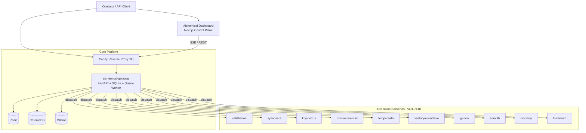

<h1 align="center">🜂 Alchemical Agent Ecosystem</h1>

<p align="center">
  
</p>

<p align="center"><em>Local-first multi-agent platform · self-hosted · modular · production-minded</em></p>

<p align="center">
  <a href="./LICENSE"></a>
  <a href="https://github.com/smouj/alchemical-agent-ecosystem/commits/main"></a>
  
  
  
</p>

<p align="center">
  <a href="./README.md"></a>
  <a href="./README.es.md"></a>
</p>

---

## ✨ Overview

**Alchemical Agent Ecosystem** is a local-first orchestration system for AI agents.
It combines:

- 🧠 **Logical agents** (dynamic, user-defined)
- ⚙️ **Execution backends** (FastAPI services)
- 🌐 **Gateway** (orchestration, registries, queue, events)
- 🖥️ **Dashboard** (control plane + SSE live streams)
- 🧱 **Infra stack** (Caddy, Redis, ChromaDB, Ollama)

---

## 🧭 Table of Contents

- [✨ Overview](#-overview)
- [🏗️ Architecture](#️-architecture)
- [🧪 Logical Agents (default seed)](#-logical-agents-default-seed)
- [🗺️ Runtime Services Map](#️-runtime-services-map)
- [🖥️ Dashboard Capabilities](#️-dashboard-capabilities)
- [🔌 API Surface](#-api-surface)
- [🚀 Installation](#-installation)
- [🛠️ CLI Commands](#️-cli-commands)
- [📦 RAM Profiles](#-ram-profiles)
- [🔒 Security Model](#-security-model)
- [🔄 Update & Rollback](#-update--rollback)
- [📁 Project Structure](#-project-structure)
- [📌 Current Limitations](#-current-limitations)
- [📜 License](#-license)

---

## 🏗️ Architecture

### High-level topology (2026 format)



### Layered architecture view

```text
┌──────────────────────────────────────────────────────────────┐
│ L4 — Experience Layer                                       │
│ Dashboard UI (Next.js): control, chat, logs, canvas, config │
├──────────────────────────────────────────────────────────────┤
│ L3 — Orchestration Layer                                    │
│ Gateway (FastAPI): auth, RBAC, agents registry, connectors, │
│ jobs queue, events, chat thread, planning, dispatch         │
├──────────────────────────────────────────────────────────────┤
│ L2 — Execution Layer                                        │
│ FastAPI runtime services (7401..7410) targetable per agent  │
├──────────────────────────────────────────────────────────────┤
│ L1 — Data/Model Layer                                       │
│ SQLite(runtime), Redis, ChromaDB, Ollama                    │
├──────────────────────────────────────────────────────────────┤
│ L0 — Infra Layer                                            │
│ Docker Compose + Caddy ingress + ops scripts (update-safe)  │
└──────────────────────────────────────────────────────────────┘
```

### Request flow (real)

1. **Operator** triggers action from Dashboard or API.
2. **Gateway** validates token/role and resolves logical agent → target backend.
3. **Dispatch** executes against selected service endpoint.
4. **Events + chat** are persisted and streamed via SSE.
5. **Dashboard** renders live updates (chat, logs, status, metrics).

---

## 🧪 Logical Agents (default seed)

The gateway seeds 5 editable logical agents:

| Agent | Mission |
|---|---|
| 🜂 Alquimista Mayor | Global orchestration, routing, quality gate |
| 🜁 Investigador/Analista | Research, verification, source comparison |
| 🔥 Ingeniero/Constructor | Code, integration, debugging, delivery |
| 🎨 Creador Visual | UI/UX, branding, visual outputs |
| ✍️ Redactor/Narrador | Copywriting, storytelling, SEO content |

> Skills/tools are capabilities attached to agents (not fixed agent identities).

---

## 🗺️ Runtime Services Map

### Agent backends

| Service | Port | Endpoint |
|---|---:|---|
| velktharion | 7401 | `/navigate` |
| synapsara | 7402 | `/query` |
| kryonexus | 7403 | `/search` |
| noctumbra-mail | 7404 | `/send` |
| temporaeth | 7405 | `/plan` |
| vaeloryn-conclave | 7406 | `/deliberate` |
| ignivox | 7407 | `/transform` |
| auralith | 7408 | `/live` |
| resonvyr | 7409 | `/voice` |
| fluxenrath | 7410 | `/` |

### Core infrastructure

| Component | Purpose |
|---|---|
| Caddy | Reverse proxy + ingress |
| alchemical-gateway | Orchestration and control API |
| Redis | Runtime key-value layer |
| ChromaDB | Vector storage layer |
| Ollama | Local model serving |

---

## 🖥️ Dashboard Capabilities

Path: `apps/alchemical-dashboard`

Implemented now:

- ✅ Live health view (services + agents)
- ✅ Start/Stop/Restart controls
- ✅ Real logs + SSE logs stream
- ✅ Shared chat thread + SSE chat stream
- ✅ Gateway workbench (agents/connectors/planning)
- ✅ Canvas Lab for visual/web workflows
- ✅ Connect / Reconnect / Disconnect stream controls

---

## 🔌 API Surface

### Gateway core

| Endpoint | Method | Purpose |
|---|---|---|
| `/gateway/health` | GET | Liveness |
| `/gateway/ready` | GET | Readiness + counters |
| `/gateway/stats` | GET | Runtime stats |
| `/gateway/events` | GET | Events feed |
| `/gateway/capabilities` | GET | Skills/tools/connectors catalog |
| `/gateway/agents` | GET/POST | List/upsert logical agents |
| `/gateway/agents/{name}` | GET | Agent detail |
| `/gateway/connectors` | GET/POST | List/upsert connectors |
| `/gateway/connectors/send` | POST | Queue outbound connector message |
| `/gateway/connectors/webhook/{channel}` | POST | Inbound connector webhook |
| `/gateway/jobs` | GET | Queue/job status |
| `/gateway/chat/thread` | GET/POST | Shared thread |
| `/gateway/chat/stream` | GET (SSE) | Realtime thread stream |
| `/gateway/chat/actions/plan` | POST | Goal planning |
| `/gateway/dispatch/{agent}/{action}` | POST | Dispatch to target service |

### Dashboard API routes

| Endpoint | Method | Purpose |
|---|---|---|
| `/api/agents` | GET | Agent inventory + status |
| `/api/system` | GET | Core health |
| `/api/control` | POST | Service actions |
| `/api/logs` | GET | Snapshot logs |
| `/api/logs/stream` | GET (SSE) | Realtime logs |
| `/api/metrics` | GET | CPU/RAM metrics |
| `/api/config` | GET/PUT | Dashboard config |
| `/api/gateway/*` | GET/POST | Gateway proxy endpoints |

---

## 🚀 Installation

### One-command installer (recommended)

```bash
cd /mnt/d/alchemical-agent-ecosystem
./install.sh --wizard
```

### Non-interactive install

```bash
./install.sh --domain localhost --profile 4g --model phi3:mini
```

---

## 🛠️ CLI Commands

```bash
./scripts/alchemical doctor
./scripts/alchemical setup-hooks
./scripts/alchemical scan-secrets
./scripts/alchemical up
./scripts/alchemical up-2g
./scripts/alchemical up-4g
./scripts/alchemical up-8g
./scripts/alchemical status
./scripts/alchemical logs velktharion
./scripts/alchemical dashboard
./scripts/alchemical update
./scripts/alchemical update-safe
./scripts/alchemical rollback
```

---

## 📦 RAM Profiles

Wizard auto-detects host RAM and suggests profile.

| Profile | Host RAM | Footprint |
|---|---:|---|
| `2g` | ~2 GB | Core + gateway + minimal services |
| `4g` | ~4 GB | Balanced setup |
| `8g` | ~8 GB | Extended runtime |
| `16g` | ~16 GB | Full stack |
| `32g` | ~32 GB | Full stack + higher model headroom |

---

## 🔒 Security Model

- 🔐 Tokenized gateway auth (`x-alchemy-token`)
- 👤 Role checks (`viewer`, `operator`, `admin`)
- 🧹 Secret scanning (`./scripts/alchemical scan-secrets`)
- 🪝 Pre-commit hook support (`setup-hooks`)
- 🧾 Connectors store `token_ref` metadata (no raw secret policy)

---

## 🔄 Update & Rollback

### Fast update

```bash
./scripts/alchemical update
```

### Safe update (recommended)

```bash
./scripts/alchemical update-safe
```

Safe flow includes lock, backup, checks, deploy, smoke-tests.

### Rollback

```bash
./scripts/alchemical rollback
```

---

## 📁 Project Structure

```text
.github/                     # GitHub workflows and templates
apps/alchemical-dashboard/   # Next.js control plane
assets/                      # Branding assets
docs/                        # Technical and operational documentation
gateway/                     # Orchestration gateway (FastAPI + SQLite queue)
infra/caddy/                 # Reverse proxy config
infra/scripts/               # Install/bootstrap scripts
ops/                         # Safe update and rollback scripts
scripts/                     # CLI and helper scripts
services/                    # Execution backends (FastAPI)
shared/                      # Shared contracts/schemas
workspace/skills/            # Skill ecosystem repositories
```

---

## 📌 Current Limitations

- GPU metrics are basic unless GPU runtime integration is enabled.
- Connector transport is queue-ready; some channel-specific delivery adapters still need hardening.
- For high-scale multi-node production, move from local SQLite to dedicated DB/event bus.

---

## 📜 License

📄 License MIT

---

<p align="center"><strong>Made with ❤️ by smouj — local models, open workflows, real automation.</strong></p>

---
