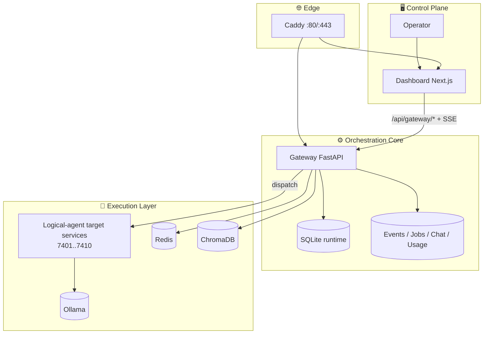
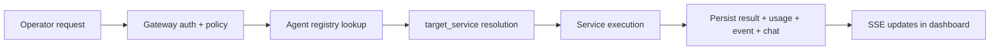

<h1 align="center">⚗️ Alchemical Agent Ecosystem</h1>

<p align="center">
  
</p>

<p align="center"><em>Local-first multi-agent runtime for real operations: chat, orchestration, connectors, jobs, events, and observable execution.</em></p>

<p align="center">
  
</p>

<p align="center">
  <a href="./LICENSE"></a>
  <a href="https://github.com/smouj/alchemical-agent-ecosystem/commits/main"></a>
  <a href="https://github.com/smouj/alchemical-agent-ecosystem/actions/workflows/ci.yml"></a>
  <a href="https://github.com/smouj/alchemical-agent-ecosystem/actions/workflows/release.yml"></a>
  <a href="https://github.com/smouj/alchemical-agent-ecosystem/actions/workflows/sync-project-status.yml"></a>
  
  
  
  
  
</p>

<p align="center">
  <a href="./README.md"></a>
  <a href="./README.es.md"></a>
</p>

---

## 🚀 Installation first (recommended)

```bash
cd /mnt/d/alchemical-agent-ecosystem
./install.sh --wizard
./scripts/alchemical up-fast
curl -fsS http://localhost/gateway/health
```

Runtime endpoints:
- `http://localhost` → Docker + Caddy runtime
- `http://localhost/gateway/health` → gateway health
- `http://localhost:3000` → dashboard dev mode (`cd apps/alchemical-dashboard && npm run dev`)

---

## ✨ What this project is for

Use this project when you need a **real operational cockpit** for project agents (the agents working inside your system, not assistant personas):

- 🧠 Orchestrate logical agents mapped to execution services
- 💬 Chat with agents and run multi-agent roundtables
- 🧩 Attach skills/tools to agents visually (Agent Node Studio)
- 📡 Connect channels (Telegram/Discord now, extensible to future socials)
- 🗂️ Observe jobs, events, usage, and logs in realtime
- 🔐 Keep operations safe with auth, RBAC, API keys, and guardrails

No mock-only dashboard behavior is used in core runtime flows.

---

## 🏗️ System architecture (current reality)



### 🔁 How the project agent runtime works



---

## 🧠 Agent model (what is shown in UI)

The dashboard now loads **logical agents from gateway data** (real source), not static skill rows.

Each agent includes:
- `name`
- `role`
- `model`
- `target_service`
- `skills[]`
- `tools[]`
- runtime status/latency from container + health checks

---

## 🧰 Implemented capabilities

| Domain | Implemented now |
|---|---|
| Agent control | Start/stop/restart, ping dispatch, runtime status |
| Agent customization | Agent Node Studio (node graph + bind/unbind skill/tool tags) |
| Chat | Shared thread, direct ask, roundtable, thinking/repo/auto-edit metadata |
| Connectors | Outbound queue + inbound webhook normalization (Telegram/Discord) |
| Realtime | SSE chat/events/usage/logs with hardened stream handling |
| Safety | Token auth, RBAC roles, API keys, rate/payload limits, secret scan |
| Ops hygiene | project-tidy + ritual-sync + auto status snapshots |

---

## 🔌 Connector roadmap

- ✅ Telegram integration base (inbound/outbound pipeline)
- ✅ Discord integration base (inbound/outbound pipeline)
- 🧭 Architecture already prepared for future social connectors via channel adapters

---

## 📊 Comparison (at a glance)

| Criteria | This project | Typical chat-only agent demos |
|---|---|---|
| Local-first operation | ✅ Core-first design | ⚠️ Often cloud-coupled |
| Policy boundary | ✅ Dedicated gateway | ⚠️ UI mixes policy/runtime |
| Agent runtime observability | ✅ jobs/events/usage/logs | ⚠️ limited or absent |
| Multi-agent orchestration | ✅ ask + roundtable + dispatch | ⚠️ mostly single-thread chat |
| GitHub project hygiene automation | ✅ integrated ritual scripts | ❌ usually manual |

---

## 📁 Repository structure

```text
.github/                    CI/CD and project workflows
apps/alchemical-dashboard/  Next.js dashboard (control plane)
gateway/                    FastAPI gateway (auth/routing/persistence)
services/                   execution services (7401..7410)
infra/caddy/                reverse proxy config
infra/scripts/              installer implementation
ops/                        safe ops + project hygiene scripts
docs/                       canonical technical/operational docs
scripts/                    alchemical CLI helpers
assets/                     branding and visual assets
```

---

## 📚 Documentation map

- [`docs/README.md`](./docs/README.md) — docs index
- [`docs/INSTALLATION.md`](./docs/INSTALLATION.md) — installation + startup
- [`docs/CLI_REFERENCE.md`](./docs/CLI_REFERENCE.md) — full command catalog
- [`docs/ARCHITECTURE.md`](./docs/ARCHITECTURE.md) — extended architecture details
- [`docs/API_REFERENCE.md`](./docs/API_REFERENCE.md) — endpoint reference
- [`docs/OPERATIONS_RUNBOOK.md`](./docs/OPERATIONS_RUNBOOK.md) — day-2 operations
- [`docs/PROJECT_STATUS.md`](./docs/PROJECT_STATUS.md) — auto-synced status snapshot

---

## 🔄 Production-safe update

```bash
cd /mnt/d/alchemical-agent-ecosystem
git pull --rebase origin main
./scripts/alchemical update-safe
```

---

## 📄 License

MIT
