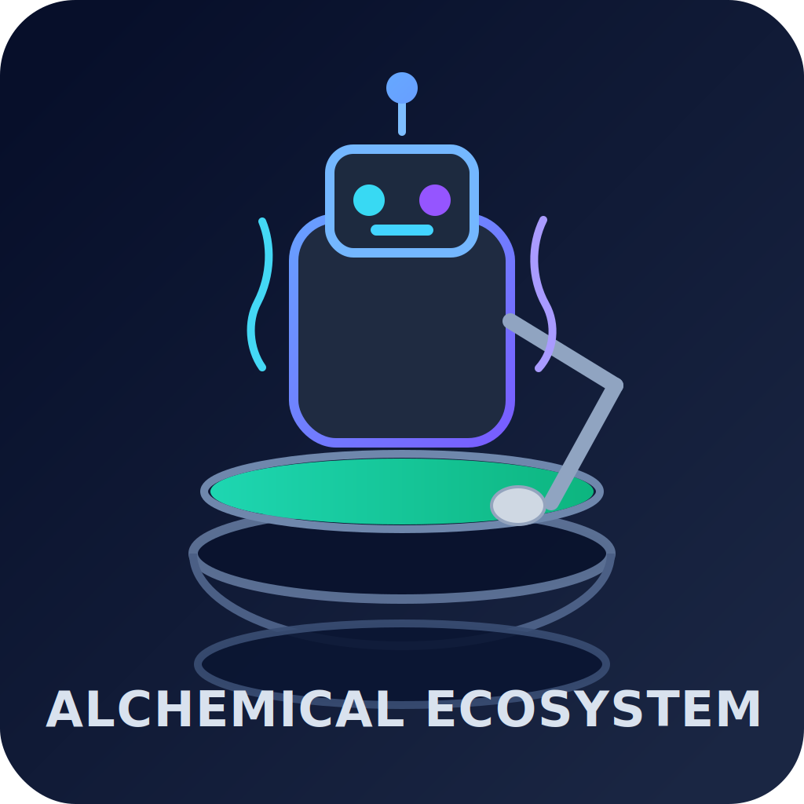

# Alchemical Agent Ecosystem

<p align="center">
  
</p>


Unified, self-hosted multi-agent platform focused on **local-first execution**, **no paid APIs**, and **low-cost operation**.

## Features
- 10 specialized agent services (7401-7410)
- Reverse proxy with Caddy (Docker service discovery, no hardcoded IPs)
- Local stack: Redis + ChromaDB + Ollama
- One-command installer flow (`install.sh`)
- Self-hosted architecture suitable for low-cost VPS and local machines

## Project Structure
- `services/*` → agent APIs
- `infra/caddy` → reverse proxy config
- `infra/scripts/install.sh` → deployment bootstrap
- `docs/*` → architecture and operations

## Quick Start (local)
```bash
cd /mnt/d/alchemical-agent-ecosystem
bash infra/scripts/install.sh --domain localhost
```

## Planned Remote Install Command
```bash
curl -fsSL https://smouj.ai/install.sh | bash -s -- --domain your-domain.com
```

## License
MIT
