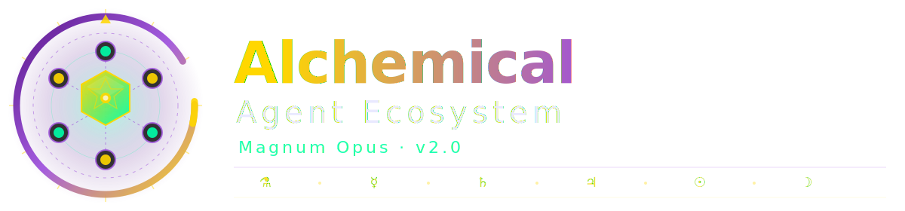
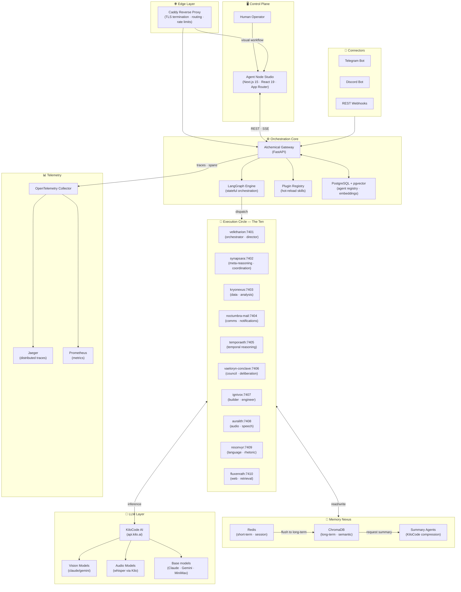
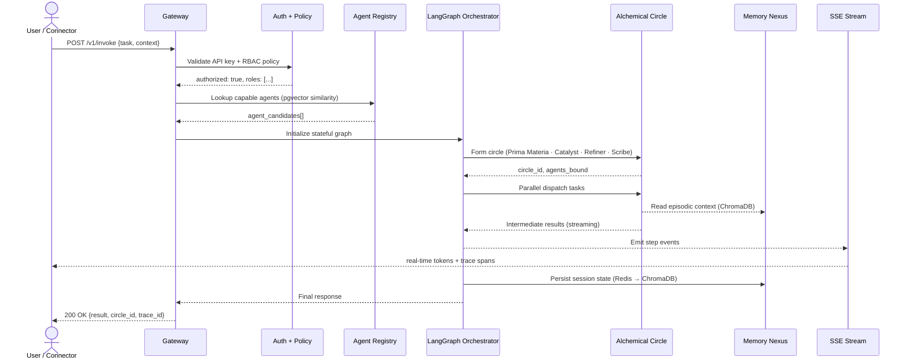

<h1 align="center">⚗️ Alchemical Agent Ecosystem</h1>

<p align="center">
  
</p>

<p align="center"><em>Where Intelligence is Forged, Not Fetched.</em></p>

<p align="center">
  
</p>

<p align="center">
  <a href="./LICENSE"></a>
  <a href="https://github.com/smouj/alchemical-agent-ecosystem/commits/main"></a>
  <a href="https://github.com/smouj/alchemical-agent-ecosystem/actions"></a>
  <a href="https://github.com/smouj/alchemical-agent-ecosystem/releases"></a>
</p>

<p align="center">
  
  
  
  
  
</p>

<p align="center">
  
  
  
  
  
</p>

<p align="center">
  
  
</p>

<p align="center">
  <a href="./README.md"></a>
  <a href="./README.es.md"></a>
</p>

---

## 🖼️ Dashboard Screenshots — 2026 Design

> **✨ New 2026 Alchemical Design System**: Deep void black (#050505), liquid gold (#d4af37) and copper accents, glassmorphism panels with holographic borders, and buttery framer-motion animations.

<p align="center">
  <strong>💬 Chat del Caldero — Multi-Agent Interaction</strong><br/>
  <em>Real-time SSE streaming with ethereal glow effects</em><br/>
  
</p>

<p align="center">
  <strong>🧩 Agent Node Studio — Visual Workflow Builder</strong><br/>
  <em>React Flow canvas with custom alchemical nodes and animated connections</em><br/>
  
</p>

<p align="center">
  <strong>🤖 Runtime de Agentes — Live Agent Status</strong><br/>
  <em>Real-time metrics with pulse animations and status indicators</em><br/>
  
</p>

<p align="center">
  <strong>📜 Logs & Telemetría — Real-time Log Streaming</strong><br/>
  <em>SSE-powered log monitor with syntax highlighting</em><br/>
  
</p>

<p align="center">
  <strong>🛠️ Administración — System Operations</strong><br/>
  <em>Settings panel with hierarchical navigation</em><br/>
  
</p>

### 🎨 Design System Features

- **Glassmorphism Panels**: Backdrop-blur with ethereal borders
- **Liquid Gold Gradients**: Animated CSS @property gradients
- **Holographic Effects**: Animated border spins and glow pulses
- **Framer Motion 12**: Page transitions, micro-interactions, staggered animations
- **Tailwind CSS v4**: Oxide engine with custom alchemical color tokens
- **React Flow Integration**: Custom node types with mini-map and controls
- **PWA Ready**: Manifest.json with theme colors and icons

---

## ✦ The Grand Transmutation

In the ancient art of alchemy, the *Magnum Opus* — the Great Work — was not merely the pursuit of gold, but the systematic transformation of base matter into something of profound and enduring value through the application of knowledge, discipline, and will. The **Alchemical Agent Ecosystem** applies this same principle to intelligence itself: raw data enters as *prima materia*, passes through a sovereign network of specialized AI agents bound together in dynamically self-forming **Alchemical Circles**, and emerges as coherent action, durable memory, and traceable decision — all orchestrated entirely on your own hardware, across ten named execution services, with zero dependency on costly APIs or external clouds. At the center stands the **Alchemical Gateway**, a FastAPI-powered philosopher's stone that mediates between intent and execution through a LangGraph-style stateful orchestration engine, backed by a three-tier hierarchical memory system spanning Redis, ChromaDB, and LLM-generated summaries. The **Agent Node Studio** makes the Great Work visible in real time — a Next.js 15 visual workflow builder where you watch intelligence transmute, step by step, token by token, streamed over SSE to a dashboard that feels less like a dev tool and more like a command room for a new kind of operation. This is local sovereignty in the age of dependent intelligence: a production-grade operating system for autonomous thought, version 2.0, **Magnum Opus**. AI inference is powered by [KiloCode AI Gateway](https://kilo.ai) — an OpenAI-compatible LLM aggregator with a free tier — while all data (PostgreSQL, Redis, ChromaDB) remains fully local.

---

## 🚀 Quickstart — The 5-Minute Ritual

> **Prerequisites:** Docker 24+, Docker Compose v2, Git, `jq` (optional but recommended), 16 GB RAM minimum, 20 GB disk. A `KILO_API_KEY` from [kilo.ai](https://kilo.ai) (free tier available).

```bash
# Clone the grimoire
git clone https://github.com/smouj/alchemical-agent-ecosystem.git
cd alchemical-agent-ecosystem

# Perform the installation ritual
# (configures KiloCode AI, generates .env, validates stack — interactive wizard)
./install.sh --wizard

# Awaken the ecosystem
./scripts/alchemical up-fast

# Verify the transmutation
curl -fsS http://localhost/gateway/health | jq .
```

Expected response from the health oracle:

```json
{
  "status": "transmuting",
  "version": "2.0.0-magnum-opus",
  "services": 10,
  "llm_engine": "kilo-ai:ready",
  "memory": { "redis": "ok", "chroma": "ok", "postgres": "ok" },
  "circles_active": 0
}
```

### Runtime Endpoints

| Endpoint | Purpose |
|---|---|
| `http://localhost:3000` | Agent Node Studio (Dashboard) |
| `http://localhost/gateway` | Alchemical Gateway API |
| `http://localhost/gateway/health` | System health oracle |
| `http://localhost/gateway/docs` | Interactive OpenAPI grimoire |
| `https://api.kilo.ai/api/gateway` | KiloCode AI Engine (configure `KILO_API_KEY`) |
| `http://localhost:6006` | OpenTelemetry Dashboard (Jaeger) |
| `http://localhost:9090` | Prometheus metrics forge |

---

## 🌌 Architecture — The Seven Circles

The ecosystem is structured as concentric layers of responsibility, each feeding the next in a closed loop of perception, reasoning, and action.



### Workflow Execution Flow



---

## ✨ Capabilities Matrix

| Feature | Status | Description |
|---|:---:|---|
| Visual Workflow Builder (Agent Node Studio) | ✅ | Drag-and-drop node canvas built on React Flow; build, test, and deploy agent pipelines visually |
| Alchemical Circles (Auto-forming agent teams) | ✅ | Orchestrator dynamically selects and binds agents into named circles for complex multi-step tasks |
| LangGraph Stateful Orchestration | ✅ | Full LangGraph-style directed graph execution with checkpointing, branching, and resumable workflows |
| Hierarchical Memory (Redis + Chroma + Summary) | ✅ | Three-tier memory: session-hot in Redis, semantic long-term in ChromaDB, compressed summaries via LLM |
| Plugin Marketplace (Skills hot-reload) | ✅ | Python packages as skills; install, enable, or swap tools without restarting any service |
| Multi-modal Vision (Vision via KiloCode) | ✅ | Image understanding and analysis via KiloCode (claude-3-haiku vision, gemini-flash) — zero image data leaves your infrastructure |
| Speech Recognition (Audio via KiloCode) | ✅ | Audio transcription and command intake via KiloCode (whisper models available) |
| Real-time SSE Observability | ✅ | Every token, every step, every trace pushed over Server-Sent Events to dashboard and API consumers |
| RBAC + API Key Security | ✅ | Role-based access control with fine-grained policy enforcement and rotating API key management |
| Telegram / Discord Connectors | ✅ | Production-ready bots that pipe conversations directly into the agent orchestration pipeline |
| OpenTelemetry + Distributed Tracing | ✅ | Full W3C trace propagation across all ten execution services, collected into Jaeger + Prometheus |
| PostgreSQL + pgvector | ✅ | Agent registry, workflow persistence, and high-dimensional vector similarity search in one engine |
| Auto-evolving Agent Prompts | 🧪 | Experimental: agents that refine their own system prompts based on observed success metrics |
| Grimoire Export / Import | 🧪 | Serialize entire workflows, agent configs, and memory snapshots to portable JSON grimoires |
| CrewAI / LangGraph Compatibility Layer | 🧪 | Import existing CrewAI or LangGraph agent definitions with minimal adaptation |
| MkDocs Alchemical Documentation | ✅ | Full documentation site built with MkDocs Material; dark theme, full-text search, versioned |
| PWA + Mobile-first Dashboard | ✅ | Agent Node Studio installable as a Progressive Web App; fully responsive on tablet and phone |
| Onboarding Wizard | ✅ | Interactive `./install.sh --wizard` guides first-time setup: model selection, env generation, smoke tests |

---

## 🧠 The Agent Model

Every entity in the ecosystem exists at two distinct layers: a **logical agent** (registered in the Gateway's PostgreSQL registry and resolved via pgvector capability matching) and an **execution context** (materialized on one of the ten named execution services at invocation time). This separation allows the registry to be the immutable source of truth for identity, capability declarations, and memory configuration, while execution services remain stateless and independently scalable.

### Logical Agent Schema

```json
{
  "id": "agt_7f3a9c2e",
  "name": "AuralScribe",
  "role": "Transcription Specialist",
  "model": "anthropic/claude-sonnet-4.5",
  "target_service": "auralith",
  "target_port": 7408,
  "skills": [
    "audio_transcription",
    "audio_chunker",
    "language_detector"
  ],
  "tools": [
    "file_reader",
    "http_fetch",
    "chroma_search"
  ],
  "circle_membership": [
    "media-analysis-circle",
    "accessibility-circle"
  ],
  "memory_config": {
    "short_term_ttl": 3600,
    "long_term_collection": "aural_scribe_episodes",
    "summary_trigger_tokens": 4096,
    "summary_model": "anthropic/claude-sonnet-4.5"
  },
  "created_at": "2025-11-14T00:00:00Z",
  "version": "2.0.0"
}
```

Agents are created, versioned, and introspected entirely through the Gateway API or the Agent Node Studio GUI. The `circle_membership` field declares which circles the agent is eligible to join; actual membership is determined dynamically by the orchestrator at task time based on capability vectors stored in pgvector. The `memory_config` block gives each agent a fully independent memory profile — different TTLs, different collections, different summarization thresholds.

---

## 🔮 Alchemical Circles

A **Circle** is the fundamental unit of collaborative intelligence in this ecosystem. When a task arrives that exceeds the capability of any single agent, the LangGraph orchestrator performs a **circle formation ritual**: it queries the agent registry using semantic similarity (pgvector), selects the best-fit agents for each required specialization, and binds them into a named, stateful working group for the lifetime of that task.

Every circle follows the classical four-role structure:

| Role | Function |
|---|---|
| **Prima Materia** | Receives the raw task; performs initial decomposition and framing |
| **Catalyst** | Injects external knowledge (web retrieval, memory search, tool calls) |
| **Refiner** | Synthesizes intermediate outputs, resolves conflicts, maintains coherence |
| **Scribe** | Records the process, writes the final output, updates all memory layers |

### Example: Market Research Circle

**Task:** `"Produce a competitive analysis of open-source vector databases as of Q4 2025"`

```
Circle ID:  circle_mkt_research_a3f8
Formed:     2025-11-14T09:12:03Z

● Prima Materia  →  temporaeth:7405  (task decomposition, sub-question extraction)
● Catalyst       →  fluxenrath:7410  (web retrieval, document ingestion)
● Refiner        →  resonvyr:7409    (synthesis, comparative framing, language polish)
● Scribe         →  kryonexus:7403   (data structuring, table generation, memory write)

Workflow steps:
  1. temporaeth   decomposes task → 6 sub-queries
  2. fluxenrath   fetches 14 sources in parallel
  3. kryonexus    structures raw data into comparison schema
  4. resonvyr     synthesizes narrative + rankings
  5. kryonexus    persists findings to ChromaDB episode store
  6. resonvyr     delivers final markdown report via Scribe output

Duration: 47s  |  Tokens: 22,840  |  Memory writes: 6  |  Trace: otel_span_9f2a
```

Circles are ephemeral by default but can be **persisted** as named templates for reuse — these become reusable **transmutation recipes** in the Agent Node Studio workflow library.

---

## 💾 Memory Architecture

Intelligence without memory is a candle that resets to dark after every conversation. The Alchemical Memory Architecture ensures that every interaction, insight, and decision accumulates into a growing substrate of knowledge — layered, searchable, and self-compressing — without a single byte of your data crossing a network boundary you do not own.

| Layer | Store | TTL | Purpose |
|---|---|---|---|
| **Short-term** | Redis | Session (default: 1h, configurable) | Active context window, in-flight state, tool call buffers, hot circle state |
| **Episodic (Long-term)** | ChromaDB | Forever (configurable eviction policy) | Semantic vector search over all past interactions, documents, and agent outputs |
| **Summary** | KiloCode AI (LLM) | On-demand (token threshold trigger) | When session tokens exceed threshold, a summary agent compresses episodic chunks into dense recall nodes |

Memory reads during a workflow are **hierarchical and non-blocking**: the orchestrator first checks Redis for live context (microseconds), then issues a cosine similarity query to ChromaDB for relevant episodes (milliseconds), and optionally triggers a summary agent to synthesize across a long interaction history before passing consolidated context to the active circle.

Memory writes follow a **dual-path pattern**: execution services post to Redis synchronously on the hot path, while a background flush worker asynchronously promotes matured session memories to ChromaDB with embeddings generated via KiloCode's embedding endpoint. All data stores (PostgreSQL, Redis, ChromaDB) remain fully local — only inference and embedding API calls are sent to KiloCode over HTTPS.

---

## 🧩 Plugin System

Skills are the vocabulary of your agents — and in the Alchemical Ecosystem, they are **hot-reloadable Python packages** that can be installed, activated, or swapped at runtime without restarting any service. Each skill declares its own dependency set, its exposed tools, and its required permissions, and is loaded into an isolated virtual environment by the Plugin Registry.

### Plugin Directory Structure

```
skills/
├── audio_transcription/
│   ├── __init__.py          # SkillManifest + entrypoint
│   ├── skill.py             # Core skill implementation
│   ├── requirements.txt     # Isolated dependency set
│   └── manifest.json        # Metadata: name, version, tools[], permissions[]
├── web_surfer/
│   ├── __init__.py
│   ├── skill.py
│   └── manifest.json
└── code_executor/
    ├── __init__.py
    ├── skill.py
    ├── sandbox.py           # Isolated execution environment
    └── manifest.json
```

### Installing a Skill

```bash
# From the official registry
./scripts/alchemical skill install web_surfer

# From a local directory
./scripts/alchemical skill install ./my_custom_skill/

# From a Git repository
./scripts/alchemical skill install git+https://github.com/org/alchemical-skill-example.git

# List all active skills and their status
./scripts/alchemical skill list

# Hot-reload all skills without restarting services
./scripts/alchemical skill reload
```

Skills are sandboxed using isolated Python virtual environments per package, with explicit `permissions[]` declarations in the manifest (e.g., `["filesystem:read", "http:outbound"]`). The Plugin Registry enforces these permissions at the Gateway level — an agent cannot invoke a tool beyond its declared permission scope, and violations are traced and logged.

The **in-dashboard marketplace** (Agent Node Studio → Plugins tab) provides a searchable catalog of community-contributed skills with one-click install, semantic version pinning, changelog display, and full audit logs.

---

## 📡 Connectors

External worlds reach the ecosystem through typed **Connectors** — each one a fully authenticated ingress that maps external message formats into the Gateway's canonical task schema. Every connector normalizes its payload to the standard `InvokeRequest` before it reaches the orchestrator, meaning agents have no awareness of which channel triggered them — enabling seamless cross-connector workflows and unified observability.

| Connector | Status | Notes |
|---|:---:|---|
| **Telegram Bot** | ✅ | Full message + file + voice ingestion; inline agent responses; group and DM support |
| **Discord Bot** | ✅ | Slash commands + message listeners; thread-aware context; role-based permissions |
| **REST Webhooks** | ✅ | Generic inbound POST endpoint; configurable topic routing; HMAC signature verification |
| **Email (noctumbra-mail)** | ✅ | IMAP/SMTP bridge via the `noctumbra-mail:7404` execution service (Port 7404) |
| **Slack** | 🔜 | Planned for v2.1 — community PRs welcome |
| **Matrix / Element** | 🔜 | E2E-encrypted channel integration — planned for v2.2 |
| **WhatsApp (Business API)** | 🔜 | In specification — community PRs welcome |

---

## 📊 Comparison

Not all agent frameworks are created equal. Here is an honest, feature-by-feature assessment of the Alchemical Ecosystem v2.0 against the most commonly cited alternatives in the local-AI space.

| Criteria | **Alchemical v2.0** | LangChain (demos) | AutoGen | CrewAI |
|---|:---:|:---:|:---:|:---:|
| **Local data sovereignty (all data stays local)** | ✅ | ❌ (OpenAI default) | ⚠️ (configurable) | ⚠️ (configurable) |
| **Visual Workflow Builder** | ✅ | ❌ | ❌ | ❌ |
| **Auto-forming Agent Teams** | ✅ | ❌ | ⚠️ (manual) | ✅ |
| **Stateful LangGraph Orchestration** | ✅ | ⚠️ (LCEL only) | ❌ | ❌ |
| **Hot-reloadable Plugin System** | ✅ | ❌ | ❌ | ❌ |
| **Real-time SSE Observability** | ✅ | ❌ | ❌ | ❌ |
| **Hierarchical Memory (3 tiers)** | ✅ | ⚠️ (1-tier) | ⚠️ (1-tier) | ⚠️ (1-tier) |
| **Free AI inference (KiloCode free tier)** | ✅ | ❌ | ❌ | ❌ |
| **Production-ready (RBAC, TLS, health checks)** | ✅ | ❌ | ❌ | ⚠️ |
| **Multi-modal (Vision + Audio)** | ✅ | ⚠️ (API-dependent) | ⚠️ | ❌ |
| **OpenTelemetry Distributed Tracing** | ✅ | ❌ | ❌ | ❌ |
| **Single-command full-stack deploy** | ✅ | ❌ | ❌ | ❌ |

> ✅ Fully supported · ⚠️ Partial / requires configuration · ❌ Not supported

---

## 📁 Repository Structure

```
alchemical-agent-ecosystem/
│
├── apps/
│   └── alchemical-dashboard/   # Agent Node Studio (Next.js 15 / React 19)
│       ├── app/                # App Router pages and layouts
│       ├── components/         # UI component library (Radix + Tailwind)
│       ├── hooks/              # Custom React hooks (SSE, agent state, etc.)
│       └── lib/                # API client, type definitions, utils
│
├── gateway/                    # Alchemical Gateway (FastAPI)
│   ├── api/                    # Route handlers (v1 endpoints)
│   ├── core/                   # LangGraph engine, circle formation, auth
│   ├── memory/                 # Redis, ChromaDB, summary agent adapters
│   ├── models/                 # Pydantic schemas and DB models
│   └── plugins/                # Plugin registry and loader
│
├── services/                   # The Ten Execution Services
│   ├── velktharion/            # Port 7401 — orchestrator and director
│   ├── synapsara/              # Port 7402 — meta-reasoning and coordination
│   ├── kryonexus/              # Port 7403 — data and analysis
│   ├── noctumbra-mail/         # Port 7404 — comms and notifications
│   ├── temporaeth/             # Port 7405 — temporal reasoning
│   ├── vaeloryn-conclave/      # Port 7406 — council and deliberation
│   ├── ignivox/                # Port 7407 — builder and engineer
│   ├── auralith/               # Port 7408 — audio and speech
│   ├── resonvyr/               # Port 7409 — language and rhetoric
│   └── fluxenrath/             # Port 7410 — web and retrieval
│
├── skills/                     # Hot-reloadable skill packages
│   ├── web_surfer/
│   ├── audio_transcription/
│   ├── code_executor/
│   └── [community skills...]
│
├── connectors/                 # External ingress adapters
│   ├── telegram/
│   ├── discord/
│   └── webhooks/
│
├── infra/                      # Infrastructure as code
│   ├── docker/                 # Per-service Dockerfiles
│   ├── compose/                # docker-compose files (dev, prod, test)
│   ├── caddy/                  # Caddyfile (reverse proxy + TLS)
│   └── otel/                   # OpenTelemetry Collector config
│
├── docs/                       # MkDocs Material documentation source
│   ├── getting-started/
│   ├── architecture/
│   ├── api-reference/
│   └── grimoire/               # Workflow recipes and tutorials
│
├── ops/                        # Safe operations + project hygiene scripts
│
├── scripts/
│   └── alchemical              # Main CLI (up, down, backup, restore, skill, etc.)
│
├── shared/                     # Shared types, utilities, constants
│
├── tests/                      # Test suites (unit, integration, e2e)
│   ├── unit/
│   ├── integration/
│   └── e2e/
│
├── assets/                     # Branding and static assets
│   └── branding/
│       └── variants/
│           └── logo-horizontal-v2.svg
│
├── workspace/                  # Runtime workspace (grimoires, exports)
├── .env.example                # Annotated environment template
├── install.sh                  # Interactive setup wizard
├── docker-compose.yml          # Production compose entrypoint
└── mkdocs.yml                  # Documentation site config
```

---

## 📚 The Grimoire — Documentation

Full documentation is available at the **Alchemical Documentation Portal**, built with MkDocs Material (dark theme, full-text search, versioned, mobile-ready).

```bash
# Serve the docs locally
./scripts/alchemical docs serve
# → http://localhost:8000
```

| Document | Description |
|---|---|
| [Getting Started](./docs/getting-started/installation.md) | Installation wizard walkthrough, prerequisites, first run |
| [Architecture Deep Dive](./docs/architecture/overview.md) | Complete system architecture, data flows, design decisions |
| [Agent Model Reference](./docs/architecture/agents.md) | Full agent schema reference, lifecycle, versioning |
| [Alchemical Circles](./docs/architecture/circles.md) | Circle formation algorithm, role assignment, lifecycle management |
| [Memory Architecture](./docs/architecture/memory.md) | Three-tier memory system internals, eviction policies, tuning |
| [Plugin Development Guide](./docs/plugins/development.md) | How to build, test, and publish skills to the marketplace |
| [Gateway API Reference](./docs/api-reference/gateway.md) | Complete OpenAPI reference for all v1 endpoints |
| [Execution Services](./docs/api-reference/services.md) | Per-service API contracts for all ten services (7401–7410) |
| [Connectors Guide](./docs/connectors/) | Setup guides for Telegram, Discord, and webhook connectors |
| [Security Model](./docs/security/rbac.md) | RBAC roles, API key management, audit logging |
| [Observability Guide](./docs/observability/otel.md) | OpenTelemetry setup, Jaeger traces, Prometheus dashboards |
| [Grimoire Recipes](./docs/grimoire/) | Ready-to-deploy workflow templates for common use cases |
| [Upgrade Guide](./docs/operations/upgrading.md) | Zero-downtime upgrade procedures and migration scripts |
| [CLI Reference](./docs/operations/cli.md) | Full reference for the `alchemical` CLI |
| [Contributing](./CONTRIBUTING.md) | Development setup, PR conventions, code style guide |

---

## 🔄 The Daily Ritual — Operations

The `./scripts/alchemical` CLI is the primary interface to the running ecosystem. It wraps Docker Compose, Alembic, and operational utilities into a single coherent command surface.

### Lifecycle Management

```bash
# Start the full stack (production mode)
./scripts/alchemical up

# Start in fast mode (skip health wait — for development)
./scripts/alchemical up-fast

# Graceful shutdown (preserves in-flight workflows)
./scripts/alchemical down

# Full restart with zero-downtime rolling update
./scripts/alchemical restart --rolling

# Check status of all services
./scripts/alchemical status
```

### Safe Updates

```bash
# Pull latest changes and update safely (zero-downtime)
./scripts/alchemical update-safe

# What update-safe does internally:
#   1. git pull --ff-only
#   2. Back up PostgreSQL + ChromaDB state
#   3. Run Alembic migration scripts
#   4. Perform rolling service restart
#   5. Run smoke tests against health endpoints
#   6. Automatically roll back on any failure
```

### Backup & Restore

```bash
# Full system backup (PostgreSQL + ChromaDB + Redis snapshot + configs)
./scripts/alchemical backup --output ./backups/$(date +%F).tar.gz

# Restore from a backup archive
./scripts/alchemical restore --from ./backups/2025-11-14.tar.gz

# Backup only the agent registry (PostgreSQL)
./scripts/alchemical backup --component=postgres

# Backup only long-term memory (ChromaDB)
./scripts/alchemical backup --component=chroma
```

### Logs & Debugging

```bash
# Tail logs for all services
./scripts/alchemical logs --follow

# Tail logs for a specific execution service
./scripts/alchemical logs --service=resonvyr --follow

# Tail logs for the gateway only
./scripts/alchemical logs --service=gateway --follow

# Export full distributed trace for a specific circle run
./scripts/alchemical trace --circle-id=circle_mkt_research_a3f8
```

### Database Migrations

```bash
# Run pending Alembic migrations
./scripts/alchemical migrate up

# Rollback the last migration
./scripts/alchemical migrate down --steps=1

# Show full migration history
./scripts/alchemical migrate history
```

---

## 🏆 Why Magnum Opus?

### Local Sovereignty in the Age of Dependent Intelligence

The dominant narrative of AI in 2025 asks you to rent intelligence — to submit your data, your prompts, your workflows, and your users' trust to remote APIs whose terms of service can change overnight, whose costs scale without warning, and whose architectures are fundamentally opaque to inspection or audit. The Alchemical Ecosystem was built on a different premise: that intelligence, like any serious operational capability, must be *owned*. Every vector embedding, every logged trace, every agent workflow, and all your data lives on your hardware, subject only to your policies, visible only to your eyes. AI inference is handled by [KiloCode AI Gateway](https://kilo.ai) — an OpenAI-compatible LLM aggregator that offers a free tier and access to state-of-the-art models (Claude, Gemini, MiniMax, and more) over HTTPS, without requiring local GPU hardware. This is not a philosophical compromise — it is an engineering pragmatism that preserves the things that matter most: data sovereignty, auditability, cost-predictability, GDPR-compliance, and genuine reliability at any scale. All data stores remain fully local. No embeddings, no agent state, no user data ever leaves your infrastructure.

### Alchemy as a Genuine Design Principle

The alchemical metaphor is not decorative — it is the actual design principle of this system. In classical alchemy, the *Magnum Opus* proceeds through defined stages: *nigredo* (dissolution of the raw), *albedo* (purification), *citrinitas* (illumination), and *rubedo* (completion and integration into the world). In this ecosystem, every task follows the same arc: raw input is dissolved by the Prima Materia agent, purified through Catalyst retrieval and Refiner synthesis, illuminated by memory and accumulated context, and completed by the Scribe into durable output that feeds future cycles. The ten execution services are not named arbitrarily — each name encodes a character and a mode of engaging with information. **Velktharion** commands and directs. **Synapsara** reflects on the whole. **Kryonexus** thinks in structure. **Noctumbra** carries messages in the dark. **Temporaeth** thinks in time. **Vaeloryn-Conclave** deliberates and councils. **Ignivox** builds and engineers. **Auralith** thinks in sound. **Resonvyr** thinks in language. **Fluxenrath** moves through the web. These are not microservices; they are *minds*, and the circles they form are the collaborative intelligence your tasks deserve.

### The Commitment to Open-Source Excellence

Version 2.0 — *Magnum Opus* — represents the culmination of a design philosophy that refuses to treat open-source as a demo tier for a paid product. Every feature in this system is complete, tested, documented, and deployable in production today. The visual workflow builder is not a prototype. The memory system is not a toy. The RBAC and security model is not an afterthought bolted on at the end. The bar is set against the best commercial AI orchestration platforms — not against what is convenient to ship, and not against what is merely novel enough to generate a GitHub star. If a feature is experimental, it is marked `🧪` and scoped clearly. If it is marked `✅`, it is ready. This is what it means to forge intelligence rather than fetch it.

---

<p align="center">
  <a href="./LICENSE"></a>
  <a href="./CONTRIBUTING.md"></a>
</p>

<p align="center">
  <em>Forged with ⚗️ and 🖤 by the Alchemical community.</em>
</p>

<p align="center">
  <sub>
    The Magnum Opus of local-first AI orchestration.<br/>
    <strong>Where Intelligence is Forged, Not Fetched.</strong>
  </sub>
</p>
