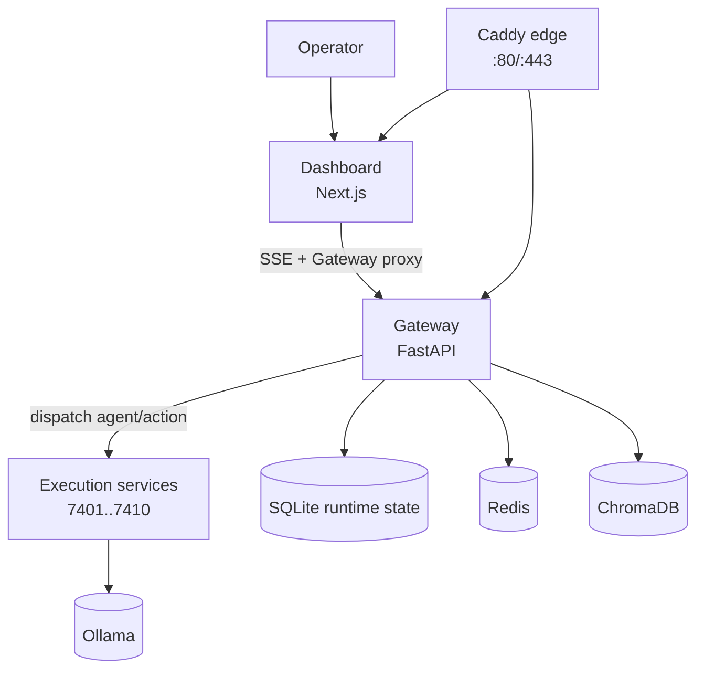
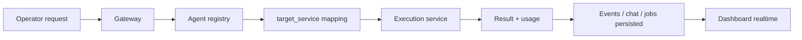

<h1 align="center">⚗️ Alchemical Agent Ecosystem</h1>

<p align="center">
  
</p>

<p align="center"><em>Local-first multi-agent platform · self-hosted · modular · production-minded</em></p>

<p align="center">
  <a href="./LICENSE"></a>
  <a href="https://github.com/smouj/alchemical-agent-ecosystem/commits/main"></a>
  
  
  
</p>

<p align="center">
  <a href="./README.md"></a>
  <a href="./README.es.md"></a>
</p>

---

## ✨ Overview

**Alchemical Agent Ecosystem** is a local-first orchestration system for AI agents.
It combines:

- 🧠 **Logical agents** (dynamic, user-defined)
- ⚙️ **Execution backends** (FastAPI services)
- 🌐 **Gateway** (orchestration, registries, queue, events)
- 🖥️ **Dashboard** (control plane + SSE live streams)
- 🧱 **Infra stack** (Caddy, Redis, ChromaDB, Ollama)

---

## 🧭 Table of Contents

- [✨ Overview](#-overview)
- [🏗️ Architecture](#️-architecture)
- [🧪 Logical Agents (default seed)](#-logical-agents-default-seed)
- [🗺️ Runtime Services Map](#️-runtime-services-map)
- [🖥️ Dashboard Capabilities](#️-dashboard-capabilities)
- [🔌 API Surface](#-api-surface)
- [🚀 Installation](#-installation)
- [📦 RAM Profiles](#-ram-profiles)
- [🔒 Security Model](#-security-model)
- [📚 Documentation Map](#-documentation-map)
- [📁 Project Structure](#-project-structure)
- [📌 Current Limitations](#-current-limitations)
- [📜 License](#-license)

---

## 🏗️ Architecture

<p align="center"><strong>Real runtime architecture (current project state)</strong></p>

<div align="center">



</div>

<p align="center"><strong>Logical agent model (real behavior)</strong></p>

<div align="center">



</div>

<div align="center">
<table>
  <thead><tr><th>Layer</th><th>Real responsibility</th></tr></thead>
  <tbody>
    <tr><td>Dashboard</td><td>Control plane UI, realtime streams, gateway proxies</td></tr>
    <tr><td>Gateway</td><td>Auth/RBAC, routing, queue/jobs, connectors, persistence</td></tr>
    <tr><td>Logical agents</td><td>Stable identities mapped to <code>target_service</code></td></tr>
    <tr><td>Execution services</td><td>Actual task execution endpoints</td></tr>
    <tr><td>Data/model layer</td><td>SQLite + Redis + ChromaDB + Ollama</td></tr>
  </tbody>
</table>
</div>

### Why this architecture is correct

1. **Clear boundary**: dashboard never bypasses gateway for protected operations.
2. **Stable logic**: agent identity is decoupled from container count.
3. **Operational reliability**: jobs/events/usage persisted and streamable.
4. **Security-first**: token auth + RBAC + connector secret hygiene.

## 🧪 Logical Agents (default seed)

The gateway seeds 5 editable logical agents:

| Agent | Mission |
|---|---|
| 👑 Alquimista Mayor | Global orchestration, routing, quality gate |
| 🔎 Investigador/Analista | Research, verification, source comparison |
| 🔥 Ingeniero/Constructor | Code, integration, debugging, delivery |
| 🎨 Creador Visual | UI/UX, branding, visual outputs |
| ✍️ Redactor/Narrador | Copywriting, storytelling, SEO content |

> Skills/tools are capabilities attached to agents (not fixed agent identities).


### Agent → Target service map (default)

| Logical agent | Target service |
|---|---|
| Alquimista Mayor | `velktharion` |
| Investigador/Analista | `synapsara` |
| Ingeniero/Constructor | `ignivox` |
| Creador Visual | `auralith` |
| Redactor/Narrador | `resonvyr` |

---

## 🗺️ Runtime Services Map

### Agent backends

| Service | Port | Endpoint |
|---|---:|---|
| velktharion | 7401 | `/navigate` |
| synapsara | 7402 | `/query` |
| kryonexus | 7403 | `/search` |
| noctumbra-mail | 7404 | `/send` |
| temporaeth | 7405 | `/plan` |
| vaeloryn-conclave | 7406 | `/deliberate` |
| ignivox | 7407 | `/transform` |
| auralith | 7408 | `/live` |
| resonvyr | 7409 | `/voice` |
| fluxenrath | 7410 | `/` |

### Core infrastructure

| Component | Purpose |
|---|---|
| [Caddy](https://caddyserver.com/) | Reverse proxy + ingress |
| `alchemical-gateway` | Orchestration and control API |
| [Redis](https://redis.io/) | Runtime key-value layer |
| [ChromaDB](https://www.trychroma.com/) | Vector storage layer |
| [Ollama](https://ollama.com/) | Local model serving |

---

## 🖥️ Dashboard Capabilities

<p align="center"><strong>Current dashboard scope (real, implemented)</strong></p>

<div align="center">
<table>
  <thead><tr><th>Area</th><th>What you can do now</th><th>Realtime</th></tr></thead>
  <tbody>
    <tr><td>System overview</td><td>View runtime status, core health, and high-level stats</td><td>✅</td></tr>
    <tr><td>Agents</td><td>Inspect agents, start/stop/restart, quick dispatch ping</td><td>✅</td></tr>
    <tr><td>Gateway Chat</td><td>Write to thread or send direct message to selected agent (<code>chat/ask</code>)</td><td>✅</td></tr>
    <tr><td>Jobs & Events</td><td>Track queue jobs, retries, and operational events</td><td>✅</td></tr>
    <tr><td>Usage & Cost</td><td>Monitor token/cost samples and usage distribution</td><td>✅</td></tr>
    <tr><td>Connectors</td><td>Configure connectors and queue outbound messages</td><td>✅</td></tr>
    <tr><td>Admin Ops</td><td>Create/disable API keys and operational controls</td><td>✅</td></tr>
    <tr><td>Logs Monitor</td><td>Observe service logs in stream mode</td><td>✅</td></tr>
  </tbody>
</table>
</div>

### UX improvements already integrated

- Left sidebar buttons now navigate to real sections (smooth scroll anchors).
- Chat panel supports two modes: **thread-only** and **direct send to agent**.
- SSE stream handlers are hardened against closed-controller crashes.
- Polling cadence tuned to reduce load while keeping realtime behavior responsive.

### Local run modes (important)

- **Full runtime via Docker/Caddy**: `http://localhost`
- **Dashboard dev mode (Next.js)**: `http://localhost:3000`

> If you want to test latest UI changes immediately, use dev mode from `apps/alchemical-dashboard`.

---

## 🔌 API Surface
## 🔌 API Surface

### Gateway core

| Endpoint | Method | Purpose |
|---|---|---|
| `/gateway/health` | GET | Liveness |
| `/gateway/ready` | GET | Readiness + counters |
| `/gateway/stats` | GET | Runtime stats |
| `/gateway/events` | GET | Events feed |
| `/gateway/events/stream` | GET (SSE) | Realtime events stream |
| `/gateway/capabilities` | GET | Skills/tools/connectors catalog |
| `/gateway/agents` | GET/POST | List/upsert logical agents |
| `/gateway/agents/{name}` | GET | Agent detail |
| `/gateway/connectors` | GET/POST | List/upsert connectors |
| `/gateway/connectors/send` | POST | Queue outbound connector message |
| `/gateway/connectors/webhook/{channel}` | POST | Inbound webhook (Telegram/Discord normalized + optional secret validation) |
| `/gateway/auth/keys` | GET/POST | List/create API keys (admin) |
| `/gateway/auth/keys/{id}/disable` | POST | Disable API key (admin) |
| `/gateway/jobs` | GET | Queue/job status |
| `/gateway/usage/summary` | GET | Usage/cost summary + samples |
| `/gateway/usage/stream` | GET (SSE) | Realtime usage/cost stream |
| `/gateway/chat/thread` | GET/POST | Shared thread |
| `/gateway/chat/stream` | GET (SSE) | Realtime thread stream |
| `/gateway/chat/actions/plan` | POST | Goal planning |
| `/gateway/dispatch/{agent}/{action}` | POST | Dispatch to target service |

### Dashboard API routes

| Endpoint | Method | Purpose |
|---|---|---|
| `/api/agents` | GET | Agent inventory + status |
| `/api/system` | GET | Core health |
| `/api/control` | POST | Service actions |
| `/api/logs` | GET | Snapshot logs |
| `/api/logs/stream` | GET (SSE) | Realtime logs |
| `/api/metrics` | GET | CPU/RAM metrics |
| `/api/config` | GET/PUT | Dashboard config |
| `/api/gateway/*` | GET/POST | Gateway proxy endpoints |

---

## 🚀 Installation

### Remote bootstrap (single command)

```bash
bash scripts/install-remote.sh
```

### One-command installer (recommended)

```bash
cd /mnt/d/alchemical-agent-ecosystem
./install.sh --wizard
```

### Non-interactive install

```bash
./install.sh --domain localhost --profile 4g --model phi3:mini
```

### Fast install mode (optimized)

```bash
# skips local build + skips model pull by default
./install.sh --fast --profile 2g

# fast path via CLI
./scripts/alchemical install-fast --profile 2g
./scripts/alchemical up-fast
```

---

## ⚡ Essential Commands (minimal)

```bash
# 1) install
./install.sh --wizard

# 2) start (fast path)
./scripts/alchemical up-fast

# 3) open dashboard
./scripts/alchemical dashboard

# 4) quick health check
curl -fsS http://localhost/gateway/health
```

For complete command catalog, maintenance rituals, and project automation:
- `docs/CLI_REFERENCE.md`
- `docs/OPERATIONS_RUNBOOK.md`

---

## 📦 RAM Profiles
## 📦 RAM Profiles

Wizard auto-detects host RAM and suggests profile.

| Profile | Host RAM | Footprint |
|---|---:|---|
| `2g` | ~2 GB | Core + gateway + minimal services |
| `4g` | ~4 GB | Balanced setup |
| `8g` | ~8 GB | Extended runtime |
| `16g` | ~16 GB | Full stack |
| `32g` | ~32 GB | Full stack + higher model headroom |

---

## 🔒 Security Model

| Control | Implementation |
|---|---|
| 🔐 Gateway token auth | Header `x-alchemy-token` + `ALCHEMICAL_GATEWAY_TOKEN` |
| 👤 Access roles | `viewer` / `operator` / `admin` checks |
| 🔑 API keys | Managed via `/gateway/auth/keys` endpoints |
| 🧹 Secret scan | `./scripts/alchemical scan-secrets` |
| 🪝 Pre-commit guard | `./scripts/alchemical setup-hooks` |
| 🧾 Connector secret policy | Store `token_ref` metadata only (no raw tokens) |

---

## 📚 Documentation Map

- [`docs/README.md`](./docs/README.md) — docs index and policy
- [`docs/ARCHITECTURE.md`](./docs/ARCHITECTURE.md) — technical architecture
- [`docs/API_REFERENCE.md`](./docs/API_REFERENCE.md) — gateway + dashboard APIs
- [`docs/INSTALLATION.md`](./docs/INSTALLATION.md) — install/start profiles and performance-first bootstrap
- [`docs/CLI_REFERENCE.md`](./docs/CLI_REFERENCE.md) — complete command catalog (moved out of README)
- [`docs/OPERATIONS_RUNBOOK.md`](./docs/OPERATIONS_RUNBOOK.md) — update/rollback/runbook
- [`docs/ALCHEMICAL_ECOSYSTEM_ROADMAP.md`](./docs/ALCHEMICAL_ECOSYSTEM_ROADMAP.md) — roadmap
- [`docs/INTEGRATION_WORKPLAN.md`](./docs/INTEGRATION_WORKPLAN.md) — integration plan
- [`docs/RELEASE_PLAN.md`](./docs/RELEASE_PLAN.md) — release strategy and versioning
- [`docs/BRANDING.md`](./docs/BRANDING.md) — logo usage and export guidance
- [`docs/PROJECT_STATUS.md`](./docs/PROJECT_STATUS.md) — auto-synced repository status snapshot
- [`docs/GO_BETA_CHECKLIST.md`](./docs/GO_BETA_CHECKLIST.md) — final readiness checklist before public beta

---

## 🔄 Update & Rollback

Use the operational runbook (single source of truth):
- `docs/OPERATIONS_RUNBOOK.md`

Most common production-safe path:

```bash
./scripts/alchemical update-safe
./scripts/alchemical rollback   # only if needed
```

For project hygiene ritual:

```bash
bash ops/ritual-sync.sh
```

---

## 📁 Project Structure
## 📁 Project Structure

| Path | Purpose |
|---|---|
| `.github/` | GitHub workflows and templates |
| `apps/alchemical-dashboard/` | Next.js control plane |
| `assets/` | Branding assets |
| `docs/` | Technical and operational documentation |
| `gateway/` | Orchestration gateway (FastAPI + SQLite queue) |
| `infra/caddy/` | Reverse proxy config |
| `infra/scripts/` | Install/bootstrap scripts |
| `ops/` | Safe update and rollback scripts |
| `scripts/` | CLI and helper scripts |
| `services/` | Execution backends (FastAPI) |
| `shared/` | Shared contracts/schemas |
| `workspace/skills/` | Skill ecosystem repositories |

---

## 📌 Current Limitations

- GPU metrics are basic unless GPU runtime integration is enabled.
- Connector transport is queue-ready; some channel-specific delivery adapters still need hardening.
- For high-scale multi-node production, move from local SQLite to dedicated DB/event bus.

---

## 📜 License

📄 License MIT

---

<p align="center"><strong>Made with ❤️ by smouj — local models, open workflows, real automation.</strong></p>

---
