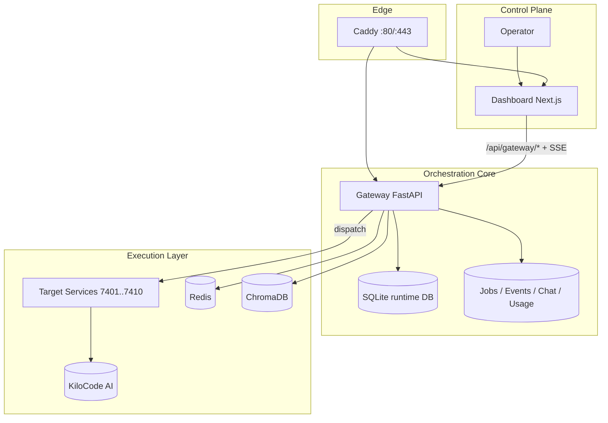
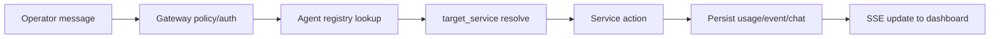

# Architecture — Alchemical Agent Ecosystem

This document defines the **real runtime architecture** (current implementation), runtime contracts, failure behavior, and operational boundaries.

---

## 1) Design intent

Alchemical is built as a **local-first multi-agent control system**:
- Dashboard is the operator cockpit.
- Gateway is the policy + routing + persistence boundary.
- Execution services perform real actions.
- Runtime data remains observable and auditable.

No mock-only core flow is considered production behavior.

---

## 2) Layered architecture (implemented)



---

## 3) Agent runtime model

Logical agents are decoupled from container names:

- `agent.name` → logical identity (orquestador, escritor, alquimista, etc.)
- `agent.target_service` → concrete execution destination
- `dispatch/{agent}/{action}` resolves through gateway registry

This preserves stable agent UX while allowing service topology changes.

---

## 4) Core runtime flows

### A) Chat ask flow (operator → single agent)



### B) Roundtable flow (operator → multi-agent)

1. Operator submits topic + agents + rounds.
2. Gateway iterates selected agents.
3. Each step executes `chat/ask` equivalent dispatch.
4. Responses and errors are persisted in chat/events.
5. Dashboard receives unified realtime transcript updates.

### C) Connector inbound/outbound

- Outbound: queue job `connector_outbound` → worker send/retry → event update.
- Inbound: webhook normalize (Telegram/Discord) + optional secret validation → queue `connector_inbound` → chat/event append.

---

## 5) Security boundaries

1. **Gateway token guard** for protected API access.
2. **RBAC**: `viewer`, `operator`, `admin`.
3. **API keys lifecycle** via gateway auth endpoints.
4. **Connector hygiene**: store references (`token_ref`) not raw secrets.
5. **Rate/payload limits** enforced at gateway boundary.

---

## 6) Reliability model

- Persistent runtime state in SQLite.
- Queue worker with retry/backoff semantics.
- SSE streams for low-latency operator feedback.
- Readiness endpoint for operational gating.

Principles:
- Fail closed on policy/auth.
- Fail visible on runtime errors (events/jobs/chat).
- Recover via retry + rollback scripts.

---

## 7) Failure-mode matrix

| Failure | Expected behavior | Operator action |
|---|---|---|
| Target service down | dispatch returns 502, event logged | restart service, check logs |
| Gateway token mismatch | 401 on protected endpoints | verify `.env` + headers |
| Connector webhook secret mismatch | 401 on inbound webhook | verify channel secret header |
| SSE client disconnect | stream closes gracefully | reconnect button / auto reconnect |
| Project sync auth conflict | gh 401 / rebase conflict | `unset GITHUB_TOKEN GH_TOKEN`, switch account, rerun ritual |

---

## 8) Architecture invariants (must stay true)

1. Dashboard does not bypass gateway for protected operations.
2. Gateway remains single source of policy/routing truth.
3. Logical agents are displayed from real gateway data.
4. Chat/events/usage/jobs persist in runtime store.
5. Docs reflect implementation state, not aspirational state.

---

## 9) Validation checklist

```bash
# health
curl -fsS http://localhost/gateway/health
curl -fsS http://localhost/gateway/ready

# runtime observability
curl -fsS http://localhost/gateway/stats
curl -fsS http://localhost/gateway/events | jq '.count'
curl -fsS http://localhost/gateway/usage/summary | jq '.summary'

# security hygiene
./scripts/alchemical scan-secrets
```

If any check fails: stop rollout, inspect logs/events/jobs, apply minimal fix, preserve rollback path.
